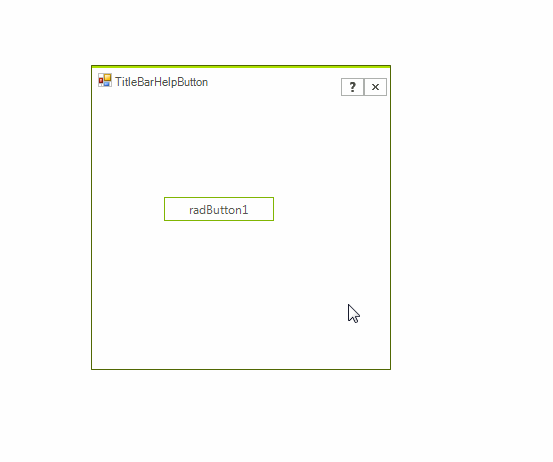

# Help Button

You can display Help on Windows Forms through the Help button, located on the right side of the title bar.

By default, the __HelpButton__ is not shown. Set the __HelpButton__ property to *true* to display a Help button in the form's caption bar. The value of the __HelpButton__ property is ignored if the *Maximize* or *Minimize* buttons are shown.
An alternative solution is to set its Visibility property to ElementVisibility.*Visible* in order to be displayed. The __HelpButtonClicked__ event is fired when Help button in the title bar is clicked. It can be canceled. However, if it is not canceled, the __HelpRequested__ event will be fired when the Help cursor is clicked on any Control.

You can find below a sample code snippet:
#### Customize selected item appearance 

<snippet id='radtitlebar-titlebarhelpbutton-helpbutton-cs' />
<snippet id='radtitlebar-titlebarhelpbutton-helpbutton-vb' />

