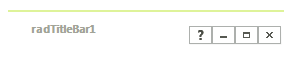

# RadTitleBar
  
__RadTitleBar__ control is used in forms and provides functionality for dragging, minimizing, maximizing and closing the form. This control is internally used by  __RadForm__.    

To include a title bar with help, maximize, minimize and close button functionality simply drag it from the toolbox on the desired form. This control is great addition to the [ShapedForm]().      	

To customize the help, minimize, maximize and close buttons, use the __RadTitleBar.TitleBarElement's HelpButton, MinimizeButton, MaximizeButton__ and __CloseButton__ objects. Each button is a __RadButtonElement__ type that include properties to control text, image, and layout.

>note By default, the __HelpButton__ is not shown. It is necessary to set its __Visibility__ property to *ElementVisibility.Visible* in order to be displayed. 

# See Also

* [Structure]()	