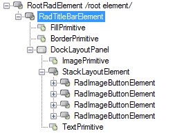
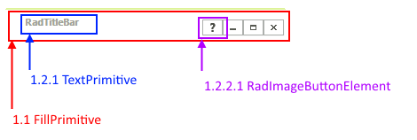

# Structure

This article describes the inner structure and organization of the elements which build the __RadTitleBar__ control.
        
>caption Figure 1: RadTitleBar's Elements Hierarchy

>caption Figure 2: RadTitleBar's structure

1. __RadTitleBarElement__  
	1.1 __FillPrimitive__: Represents the fill of __RadTitleBar__    
	1.2 __DockLayoutPanel__: Holds the system buttons and text element   
&nbsp;&nbsp;&nbsp;&nbsp; 1.2.1 __TextPrimitive__: Represents the text of __RadTitleBar__  
&nbsp;&nbsp;&nbsp;&nbsp; 1.2.2 __StackLayoutElement__: Holds the system buttons   
&nbsp;&nbsp;&nbsp;&nbsp;&nbsp;&nbsp;&nbsp;&nbsp; 1.2.2.1 __RadImageButtonElement__: Represents each of the system buttons.

# See Also

* [Help Button]()	
