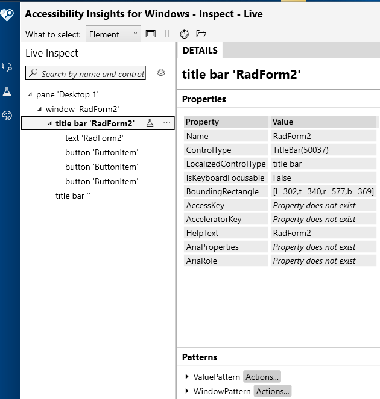

# UI Automation Support

With the __Q1 2026 Minor__ version of our controls, RadTitleBar supports UI Automation. The current implementation of UI Automation for RadTitleBar is similar to the MS WinForms TitleBar Control implementation with some extended functionality. The main goal of this implementation is to ensure compliance with accessibility standards and to provide a common practice for automated testing. 

| **UIA Tree Structure**|
|------------------------|
| ├─ RadTitleBar (TitleBar)|
| &nbsp;&nbsp; ├── ImagePrimitive (icon if non-empty) |
| &nbsp;&nbsp; ├── TextPrimitive (caption text if non-empty) |
| &nbsp;&nbsp; ├── ButtonItem (help button if visible) |
| &nbsp;&nbsp; ├── ButtonItem (minimize button if visible)|
| &nbsp;&nbsp; ├── ButtonItem (maximize button if visible)|
| &nbsp;&nbsp; └── ButtonItem (close button if visible)|


This functionality is enabled by default. To disable it, you can set the __EnableUIAutomation__ property to false.

````C#

this.radTitleBar1.EnableUIAutomation = false;

````
````VB.NET

Me.RadTitleBar1.EnableUIAutomation = False

````



## Relevant Properties 

The table below outlines the __UI Automation__ properties most important for understanding and interacting with RadTitleBar control.

#### RadTitleBar 

* AutomationElementIdentifiers.ControlTypeProperty.Id => ControlType.TitleBar.Id
* AutomationElementIdentifiers.LocalizedControlTypeProperty.Id => "title bar"
* AutomationElementIdentifiers.NameProperty.Id
* AutomationElementIdentifiers.AutomationIdProperty.Id
* AutomationElementIdentifiers.HelpTextProperty.Id
* AutomationElementIdentifiers.IsContentElementProperty.Id => false
* AutomationElementIdentifiers.IsControlElementProperty.Id => true
* AutomationElementIdentifiers.IsKeyboardFocusableProperty.Id => false
* AutomationElementIdentifiers.IsWindowPatternAvailableProperty.Id => true
* AutomationElementIdentifiers.ClickablePointProperty.Id
* AutomationElementIdentifiers.BoundingRectangleProperty.Id

## Supported Control Patterns

The following section outlines the supported automation patterns for the __RadButton__ control and its constituent elements.

* [Invoke Pattern](https://learn.microsoft.com/en-us/dotnet/api/system.windows.automation.provider.iinvokeprovider?view=windowsdesktop-9.0)
* [WindowPattern](https://learn.microsoft.com/en-us/dotnet/api/system.windows.automation.provider.iwindowprovider?view=windowsdesktop-9.0)

## Navigation

Navigation between child elements is handled entirely by `TitleBarUIAService`:

* `Navigate(FirstChild)`: returns the first visible child provider
* `Navigate(LastChild)`: returns the last visible child provider
* `NavigateNextSibling(child)`: returns the next sibling by index in the visible children list
* `NavigatePreviousSibling(child)`: returns the previous sibling by index


