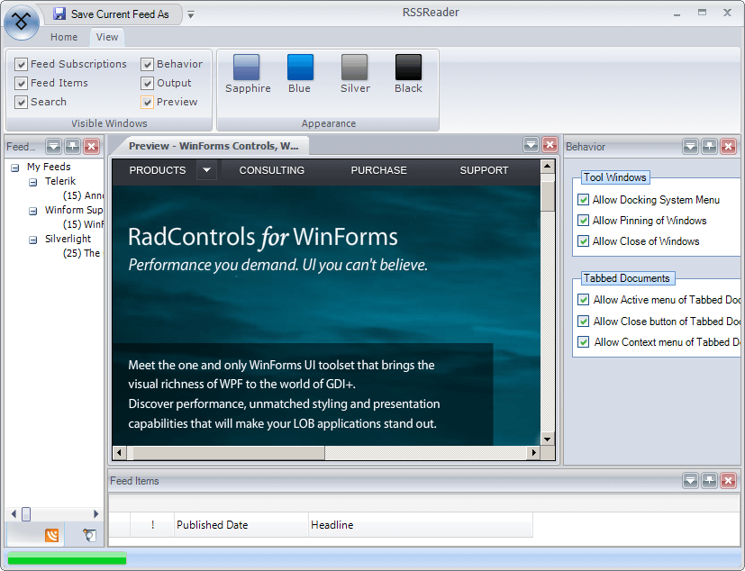

# WinForms RibbonForm Overview

The __RadRibbonForm__ control is designed to host a __RadRibbonBar__ control and mimic the Microsoft Office 2007 UI form style. This control automatically detects whether it runs under Windows Vista and Desktop Window Manager Effects are enabled and adjusts itself to make use of these effects just as Microsoft Office 2007 applications do.

The following screenshot shows the __RadRibbonForm__ control in action:





## Telerik UI for WinForms Learning Resources
* [Telerik UI for WinForms RibbonForm Homepage](https://www.telerik.com/products/winforms/ribbonform.aspx)
* [Get Started with the Telerik UI for WinForms RibbonForm]()
* [Telerik UI for WinForms API Reference](https://docs.telerik.com/devtools/winforms/api/)
* [Getting Started with Telerik UI for WinForms Components]()
* [Telerik UI for WinForms Virtual Classroom (Training Courses for Registered Users)](https://learn.telerik.com/learn/course/external/view/elearning/17/TelerikUIforWinForms) 
* [Telerik UI for WinForms Forum](https://www.telerik.com/forums/winforms)
* [Telerik UI for WinForms Knowledge Base](https://docs.telerik.com/devtools/winforms/knowledge-base)

## Telerik UI for WinForms Additional Resources
* [Telerik UI for WinForms Product Overview](https://www.telerik.com/products/winforms.aspx)
* [Telerik UI for WinForms Blog](https://www.telerik.com/blogs/desktop-winforms)
* [Telerik UI for WinForms Videos](https://www.telerik.com/videos/product/winforms)
* [Telerik UI for WinForms Roadmap](https://www.telerik.com/support/whats-new/winforms/roadmap)
* [Telerik UI for WinForms Pricing](https://www.telerik.com/purchase/individual/winforms.aspx)
* [Telerik UI for WinForms Code Library](https://www.telerik.com/support/code-library/winforms)
* [Telerik UI for WinForms Support](https://www.telerik.com/support/winforms)
* [What’s New in Telerik UI for WinForms](https://www.telerik.com/support/whats-new/winforms)

# See Also 

* [RadForm]()
* [RadRibbonBar]()
* [Getting Started]()
