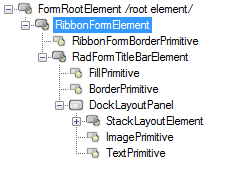
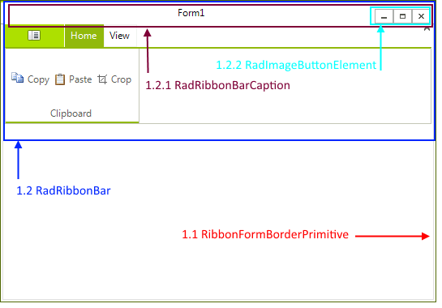

# Structure

This article describes the inner structure and organization of the elements which build the __RadRibbonForm__ control.
        
>caption Figure 1: RadRibbonForm's elements hierarchy

>caption Figure 2: RadRibbonForm's structure

 1. __RibbonFormElement__  
  1.1 __RibbonFormBorderPrimitive__: represents the form's border  
  1.2 __RadRibbonBar__: represents the ribbon bar    
     &nbsp;&nbsp;&nbsp;&nbsp;&nbsp;1.2.1 __RadRibbonBarCaption__: represents the caption  
     &nbsp;&nbsp;&nbsp;&nbsp;&nbsp;1.2.2 __RadImageButtonElement__: represents each system button.  

# See Also 

* [Getting Started]()
