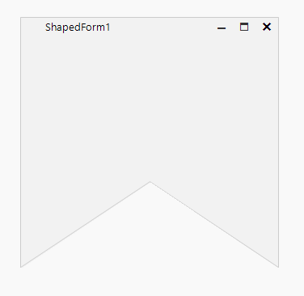

# WinForms ShapedForm Overview

The __ShapedForm__ control allows you to design and display a Windows form with any conceivable shape. You can couple this control with the [RadTitleBar control]() to easily add forms with a completely custom look and feel to your applications.





>note s of R3 2023 the rounded corners are available for the ShapedForm. By default, the rounded corners are not enabled on OS Windows 11. They can be enabled by setting the ShapedForm.WindowsSettings.__EnableRoundedCorners__ property to *true*. It is recommended to use the above API with rectangular shapes, other shapes may lead to unexpected results. Read more in the [Rounded Corners]()

## Telerik UI for WinForms Learning Resources
* [Telerik UI for WinForms ShapedForm Homepage](https://www.telerik.com/products/winforms/shapedform.aspx)
* [Get Started with the Telerik UI for WinForms ShapedForm]()
* [Telerik UI for WinForms API Reference](https://docs.telerik.com/devtools/winforms/api/)
* [Getting Started with Telerik UI for WinForms Components]()
* [Telerik UI for WinForms Virtual Classroom (Training Courses for Registered Users)](https://learn.telerik.com/learn/course/external/view/elearning/17/TelerikUIforWinForms) 
* [Telerik UI for WinForms Forum](https://www.telerik.com/forums/winforms)
* [Telerik UI for WinForms Knowledge Base](https://docs.telerik.com/devtools/winforms/knowledge-base)

## Telerik UI for WinForms Additional Resources
* [Telerik UI for WinForms Product Overview](https://www.telerik.com/products/winforms.aspx)
* [Telerik UI for WinForms Blog](https://www.telerik.com/blogs/desktop-winforms)
* [Telerik UI for WinForms Videos](https://www.telerik.com/videos/product/winforms)
* [Telerik UI for WinForms Roadmap](https://www.telerik.com/support/whats-new/winforms/roadmap)
* [Telerik UI for WinForms Pricing](https://www.telerik.com/purchase/individual/winforms.aspx)
* [Telerik UI for WinForms Code Library](https://www.telerik.com/support/code-library/winforms)
* [Telerik UI for WinForms Support](https://www.telerik.com/support/winforms)
* [What’s New in Telerik UI for WinForms](https://www.telerik.com/support/whats-new/winforms)

# See Also

* [Getting Started]()	
* [Rounded Corners]()

