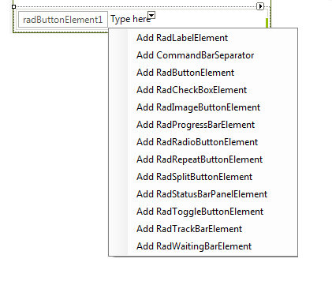
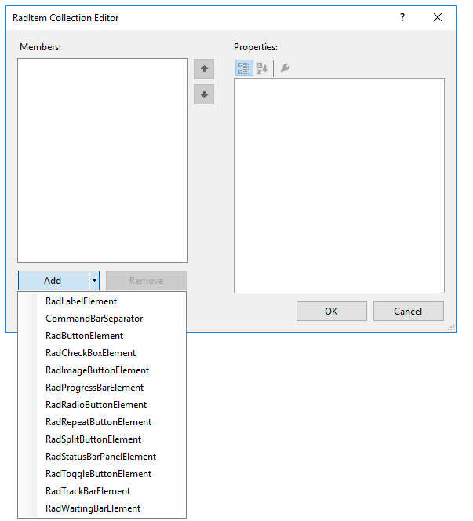

This article demonstrates what items can be added to __RadStatusStrip__ either at design time or at run time. 
 
## Item Element Types

The following element types can be added to RadStatusStrip.__Items__ collection:

* __RadLabelElement__
* __CommandBarSeparator__
* __RadButtonElement__
* __RadCheckBoxElement__
* __RadImageButtonElement__
* __RadProgressBarElement__
* __RadRadioButtonElement__
* __RadRepeatButtonElement__
* __RadSplitButtonElement__
* __RadStatusStripPanelElement__
* __RadToggleButtonElement__
* __RadTrackBarElement__
* __RadWaitingBarElement__

## Adding Items At Design-Time

There are several alternatives for adding and editing the RadStatusStrip.__Items__ collection in the designer:

* Click on the *Type here* label and edit directly. When you're done, click `Enter` to save your changes. Click `Esc` to abandon the changes.

* Click the  down arrow in the *Type here* label and select the desired element to add.

>caption Figure 1: Add items at design time

* From the __Properties__ Editor select the __Items__ property ellipses to open the __RadItem Collection Editor__.

>caption Figure 2: RadItem Collection Editor

## Adding Items At Run-Time

Add items at run time by creating __RadElement__ instances and adding them to the RadStatusStrip.__Items__ collection. The example below demonstrates creating and adding __RadLabelElement__, __RadButtonElement__, __RadRepeatButtonElement__, __RadToolBarSeparatorElement__ and __RadProgressBarElement__.

>caption Figure 3: Adding items at run time

#### Adding Elements to RadStatusStrip 

<snippet id='statusstrip-statusstrip1-addingelementstoradstatusstrip-cs' />
<snippet id='statusstrip-statusstrip1-addingelementstoradstatusstrip-vb' />

# See Also

* [Properties and Events]()	
* [Getting Started]()	

