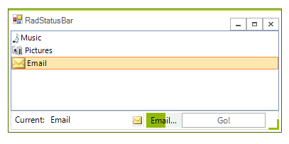
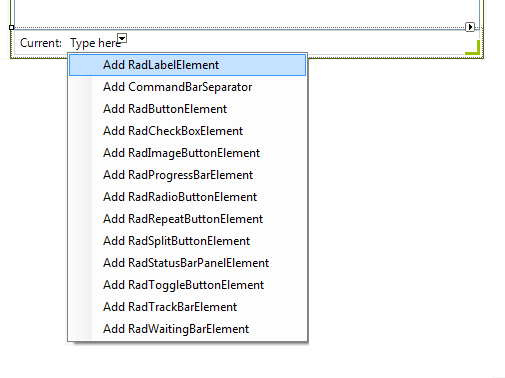

# Getting Started with WinForms StatusStrip
 
The following tutorial demonstrates configuring __RadStatusStrip__ at design-time and programmatic access of individual status bar items at run-time. The status bar contains label, separator, buttons and progress bar elements. One of the button elements increments the __RadListControl__ selected index. The label and one of the button elements reflect the current selection in the __RadListControl__ while the progress bar mimics a process against the upcoming item.
        


1\. Add a __RadStatusStrip,__ and a __RadListControl__ to a form. 
        
2\. Take three images of your choice and set them as project resources.

3\. In the designer click the __RadStatusStrip__ label *Type here* and enter *Current:*. This step is one way to create a __RadLabelElement__ in __RadStatusStrip__ and populate it.

4\. Using the downward arrow of the __RadStatusStrip__ add a __RadLabelElement__. In the __Properties Window__ set the __Name__ property to be *lblStatus* and the __Spring__ property to __true__.

>note Setting the **Spring** property to *true* will stretch horizontally the respective element. Thus, this element will occupy the free space and the rest of the elements will be positioned on the right most side when resizing the **RadStatusStrip**. You can also use **SetSpring** method of **RadStatusStrip** and pass the element that needs to stretch horizontally.
            


5\. In the *Type here* element click the downward arrow. Add the following elements:
            
1. __RadImageButtonElement__

1. __CommandBarSeparator__

1. __RadProgressBarElement__

1. __RadButtonElement__ 

6\. Use the Properties window to set the following properties to the elements above:

1. __RadImageButtonElement: Name__ = "imgStatus", __DisplayStyle__ = *Image*.
                
1. __CommandBarSeparator__. *There are no properties to set for the separator element.*

1. __RadProgressBarElement__: __Name__ = "pbStatus"
                
1. __RadButtonElement: Name__ = "btnStatus", __Text__ = "Go!", __Spring__ = __true__.
                
7\. Double-click "btnStatus" to create a __Click__ event handler. Add the code below to replace the event handler. This code block bumps the list control selected index until the end of the list is reached, and then moves the index back to the first item in the list.
  
{{source=..\SamplesCS\Forms And Dialogs\StatusStripGettingStarted.cs region=statusClick}} 
{{source=..\SamplesVB\Forms And Dialogs\StatusStripGettingStarted.vb region=statusClick}} 

````C#
private void btnStatus_Click(object sender, EventArgs e)
{
    if (radListControl1.SelectedIndex >= radListControl1.Items.Count - 1)
        radListControl1.SelectedIndex = 0;
    else
        radListControl1.SelectedIndex += 1;
}

````
````VB.NET
Private Sub btnStatus_Click(ByVal sender As System.Object, ByVal e As System.EventArgs) Handles btnStatus.Click
    If RadListControl1.SelectedIndex >= RadListControl1.Items.Count - 1 Then
        RadListControl1.SelectedIndex = 0
    Else
        RadListControl1.SelectedIndex += 1
    End If
End Sub

````

{{endregion}} 

8\. In the __Properties Window__ for the __RadListControl:__

1. Set the __Dock__ property to __Fill__.
                
1. Select the __Items__ property ellipses. This will open the __RadItem Collection Editor__.
                
1. Click the __Add__ button. Set the __RadListDataItem.Text__ property to "Music", __TextImageRelation__ to ImageBeforeText and __Image__ to one of the images previously set as project resources.
                
1. Click the __Add__ button. Set the __RadListDataItem.Text__ property to "Pictures", __TextImageRelation__ to ImageBeforeText and __Image__ to one of the images previously set as project resources.
                
1. Click the __Add__ button. Set the __RadListDataItem.Text__ property to "Email", __TextImageRelation__ to ImageBeforeText and __Image__ to one of the images previously set as project resources.
                
1. Click __OK__ to close the __RadItem Collection Editor__.
                
9\. In the __Properties Window__ for the __RadListControl__ select the __Events__ button.
            
10\. Locate and double-click the __RadListControl.SelectedIndexChanged__ event to create an event handler.
            
11\. Paste the following code to the __SelectedIndexChanged__ event handler.  *The code retrieves the selected item and assigns the text and image for the selected item to the status bar label and image elements. Then the progress bar element mimics an operation against the newly selected item.*
 

{{source=..\SamplesCS\Forms And Dialogs\StatusStripGettingStarted.cs region=selectedIndexChanged}} 
{{source=..\SamplesVB\Forms And Dialogs\StatusStripGettingStarted.vb region=selectedIndexChanged}} 

````C#
void radListControl1_SelectedIndexChanged(object sender, Telerik.WinControls.UI.Data.PositionChangedEventArgs e)
{
    RadListElement listControl = (sender as RadListElement);
    RadListDataItem item = listControl.SelectedItem;
    lblStatus.Text = item.Text;
    imgStatus.Image = item.Image;
    pbStatus.Visibility = Telerik.WinControls.ElementVisibility.Visible;
    for (int i = 0; i < 100; i++)
    {
        pbStatus.Value1 = i;
        pbStatus.Text = item.Text + "...";
        radStatusStrip1.Refresh();
        Thread.Sleep(5);
    }
    pbStatus.Visibility = Telerik.WinControls.ElementVisibility.Collapsed;
}

````
````VB.NET
Private Sub RadListControl1_SelectedIndexChanged(ByVal sender As System.Object, ByVal e As Telerik.WinControls.UI.Data.PositionChangedEventArgs) Handles RadListControl1.SelectedIndexChanged
    Dim listControl As RadListElement = TryCast(sender, RadListElement)
    Dim item As RadListDataItem = listControl.SelectedItem
    lblStatus.Text = item.Text
    imgStatus.Image = item.Image
    pbStatus.Visibility = Telerik.WinControls.ElementVisibility.Visible
    Dim i As Integer = 0
    While i < 100
        pbStatus.Value1 = i
        pbStatus.Text = item.Text + "..."
        Thread.Sleep(5)
        System.Math.Max(System.Threading.Interlocked.Increment(i), i - 1)
    End While
    pbStatus.Visibility = Telerik.WinControls.ElementVisibility.Hidden
End Sub

````

{{endregion}} 

12\. Add __Telerik.WinControls.UI__ and __System.Threading__ references to the "using" (C#) or Imports (VB) section of the code.
            
{{source=..\SamplesCS\Forms And Dialogs\StatusStripGettingStarted.cs region=namespaces}} 
{{source=..\SamplesVB\Forms And Dialogs\StatusStripGettingStarted.vb region=namespaces}} 

````C#
using Telerik.WinControls.UI;
using System.Threading;

````
````VB.NET
Imports Telerik.WinControls.UI
Imports System.Threading

````

{{endregion}} 

13\. Press __F5__ to run the application. Press the "Go!" button to see the status bar react to list control changes.


# See Also

* [Properties and events]()
            

## Telerik UI for WinForms Learning Resources
* [Telerik UI for WinForms StatusStrip Component](https://www.telerik.com/products/winforms/statusstrip.aspx)
* [Getting Started with Telerik UI for WinForms Components](https://docs.telerik.com/devtools/winforms/getting-started/first-steps)
* [Telerik UI for WinForms Setup](https://docs.telerik.com/devtools/winforms/installation-and-upgrades/installing-on-your-computer)
* [Telerik UI for WinForms Application Modernization](https://docs.telerik.com/devtools/winforms/winforms-converter/overview)
* [Telerik UI for WinForms Visual Studio Templates](https://docs.telerik.com/devtools/winforms/visual-studio-integration/visual-studio-templates)
* [Deploy Telerik UI for WinForms Applications](https://docs.telerik.com/devtools/winforms/deployment-and-distribution/application-deployment)
* [Telerik UI for WinForms Virtual Classroom(Training Courses for Registered Users)](https://learn.telerik.com/learn/course/external/view/elearning/17/telerik-ui-for-winforms)
* [Telerik UI for WinForms License Agreement)](https://www.telerik.com/purchase/license-agreement/winforms-dlw-s)

