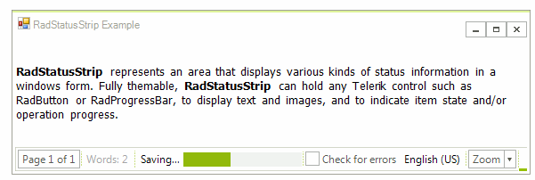

# StatusStrip
 
__RadStatusStrip__ provides a status area that can be composed of any number of __RadElement__ types: buttons, repeat buttons, image buttons, labels, panels, progress bars and separators. The elements can be laid out along the horizontal or wrapped to additional rows. __RadStatusStrip__ can be styled using one of the predefined themes or a theme that you create in Visual Style Builder.





# See Also

* [Structure]()
* [Getting Started]()
