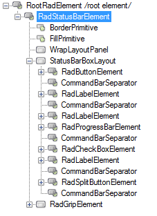
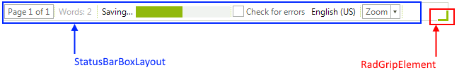

# Structure

This article describes the inner structure and organization of the elements which build the __RadStatusStrip__ control.
        
>caption Figure 1: RadStatusStrip's elements hierarchy

>caption Figure 2: RadStatusStrip's structure

1 __RadStatusBarElement__  
	&nbsp;&nbsp;1.1 __WrapLayoutPanel__: Represents the wrap layout panel that holds the items when the __LayoutStyle__ is *Overflow*.   
	&nbsp;&nbsp;1.2 __StatusBarBoxLayout__: Represents the box layout panel that holds the items when the __LayoutStyle__ is *Stack*.     
	&nbsp;&nbsp;1.3 __RadGripElement__: Represents the re-sizing grip element.
  

# See Also

* [Getting Started]()

 