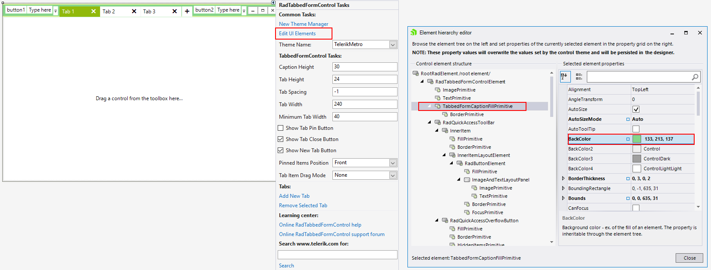

# Design Time

You can access and modify the style for the different elements in the editable area of __RadTabbedForm__ by using the Element hierarchy editor.

# Programmatically

The following example demonstrates how you can aces the visual item of the tab and change it back color. 

### Access the tab visual element

{{source=..\SamplesCS\Forms_And_Dialogs\TabbedFormCode.cs region=Appearance}} 
{{source=..\SamplesVB\Forms_And_Dialogs\TabbedFormCode.vb region=Appearance}} 

{{endregion}}  

# See Also

* [Themes]()