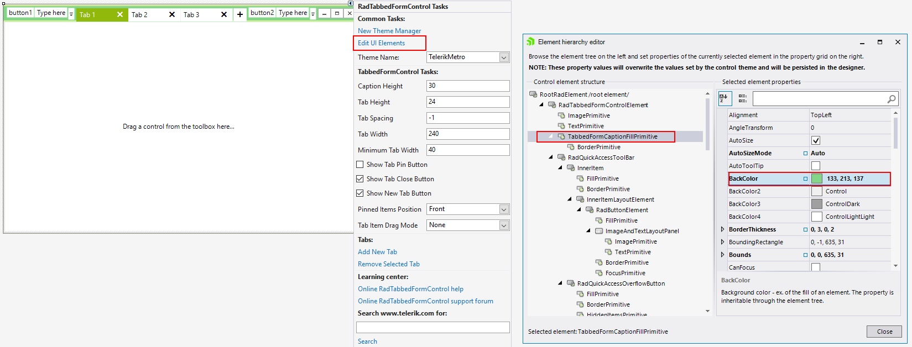

# Design Time

You can access and modify the style for the different elements in the editable area of __RadTabbedForm__ by using the Element hierarchy editor.

# Programmatically

The following example demonstrates how you can access the visual item of the tab and change its back color. 

### Access the tab visual element

<snippet id='tabbedform-tabbedformcode-appearance-cs' />
<snippet id='tabbedform-tabbedformcode-appearance-vb' />

# See Also

* [Themes]()
