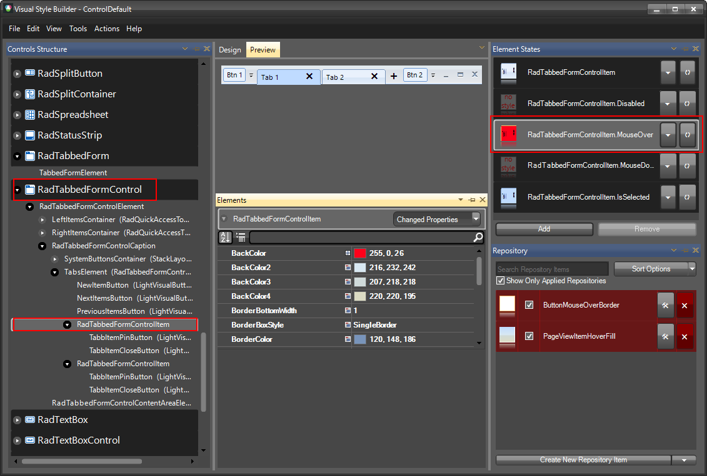
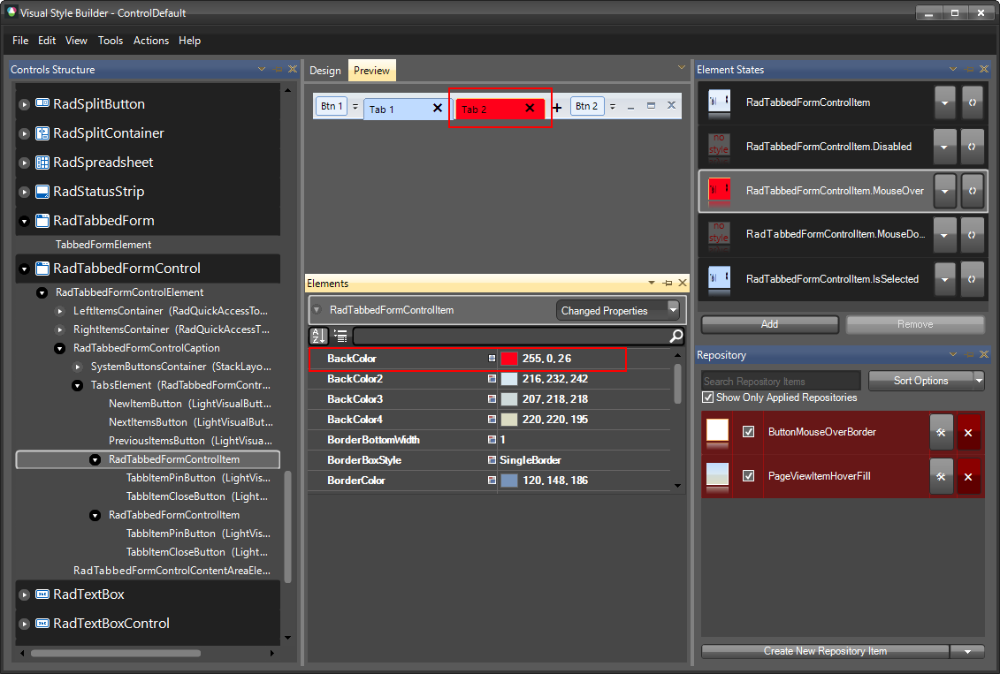
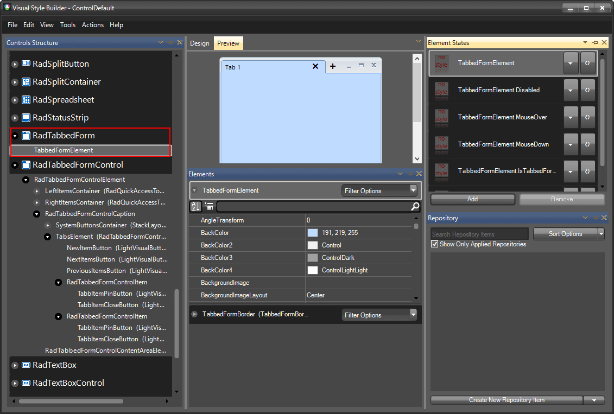
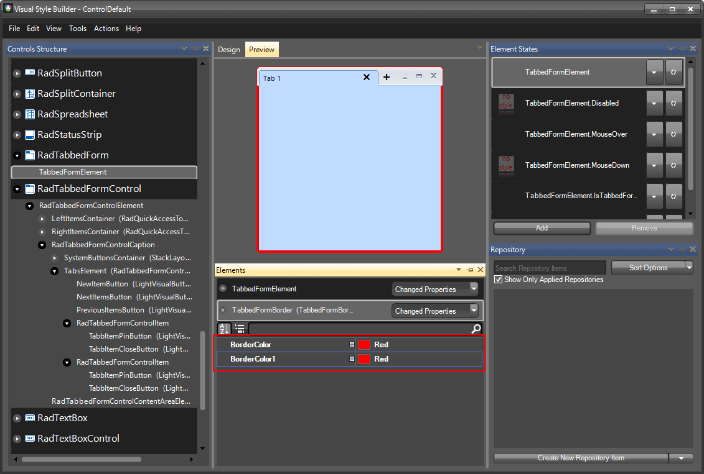

# Themes

This help article will demonstrate a step by step tutorial how to customize the ControlDefault theme for __RadTabbedForm__.

## Styling RadTabbedFormControl

The **RadTabbedFormControl** item in Visual Style Builder gives you access to the title bar, the tabs and all the default buttons. 

1. Open [VisualStyleBuilder](): Start menu (Start >> Programs >> Telerik >> UI for WinForms [version] >> Tools).

1. Export the built-in themes in a specific folder by selecting *File >> Export Built-in Themes*.

1. Load a desired theme from the just exported files by selecting *File >> Open Package*.

1. Select __RadTabbedFormControl__ in *Controls Structure* on the left side. Then, select __MouseOver__ in the *Element States* section.

    

1. Modify the *BackColor* and the *Gradient Style* of the item. Now, when a tab is hovered its back color will be red.
    
    

## Styling RadTabbedForm

The __RadTabbedForm__ item in Visual Style Builder gives you access to the content area and the border of the form.

1. Open [VisualStyleBuilder](): Start menu (Start >> Programs >> Telerik >> UI for WinForms [version] >> Tools).

1. Export the built-in themes in a specific folder by selecting *File >> Export Built-in Themes*.

1. Load a desired theme from the just exported files by selecting *File >> Open Package*.

1. Select __RadTabbedFormElement__ in *Controls Structure* on the left side.  

    

1. Modify the *BorderColor* of the item.
    
    

# See Also

* [Customizing Appearance]()
