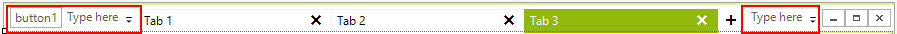
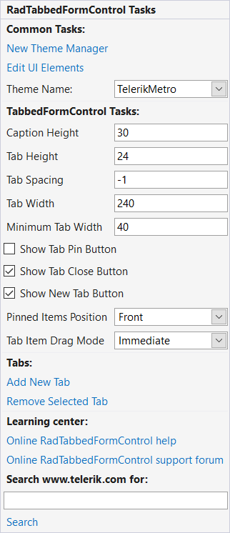

## Design Time

At design time you can directly type on the left or right part to add buttons.

>caption Figure 1: RadTabbedForm add buttons to the left or right.

>important When the content area or a tab is selected you cannot resize the form. Just pres __Esc__ and the parent form will be selected. 

## Smart Tag

>caption Figure 2: RadTabbedForm smart tag.

* __Common Tasks__
    - __New Theme Manager:__ Adds a new __RadThemeManager__ component to the form.
    - __Edit UI elements:__ Opens a dialog that displays the __Element Hierarchy Editor.__ This editor lets you browse all the elements in the control.
    - __Theme Name:__ Select a theme name from the drop down list of themes available for that control. Selecting a theme allows you to change all aspects of the controls visual style at one time.
* __TabbedFormControl Tasks__
    - __Caption Height:__ Set the height of the entire title bar.
    - __Tab Height:__ Set the height of all tabs.
    - __Tab Spacing:__ Set the space between the tabs.
    - __Tab Width:__ Set the width of all tabs.
    - __Minimum Tab Width:__ Set the minimum tabs width.
    - __Pinned Items Position:__ Set the position of the pinned tabs.
    - __Tab Item Drag Mode:__ Set the drag drop mode.
* __Tabs__
    - Add or remove tabs.
* __Learning Center:__ Navigate to the Telerik help, code library projects or support forum.
* __Search:__ Search the Telerik site for a given string.

# See Also

* [Structure]()
* [Getting Started]()