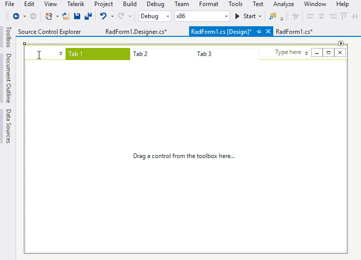
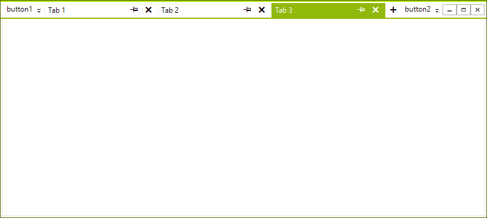

# Buttons


By default you can add buttons to the in front of or after the tabs. This can be done at design time by directly typing the button text. 

>caption Figure 1: Add buttons at design time.




You can the buttons in the code behind as well. This is demonstrated in the following example.

#### Adding Buttons Programmatically

{{source=..\SamplesCS\Forms and Dialogs\TabbedFormCode.cs region=Buttons}} 
{{source=..\SamplesVB\Forms and Dialogs\TabbedFormCode.vb region=Buttons}}
````C#
this.TabbedFormControl.LeftItems.Add(new RadButtonElement { Text = "button1" });
this.TabbedFormControl.RightItems.Add(new RadButtonElement { Text = "button2" });

````
````VB.NET
Me.TabbedFormControl.LeftItems.Add(New RadButtonElement With {.Text = "button1"})
Me.TabbedFormControl.RightItems.Add(New RadButtonElement With {.Text = "button2"})

```` 

{{endregion}} 

>caption Figure 1:Adding Buttons Programmatically.

