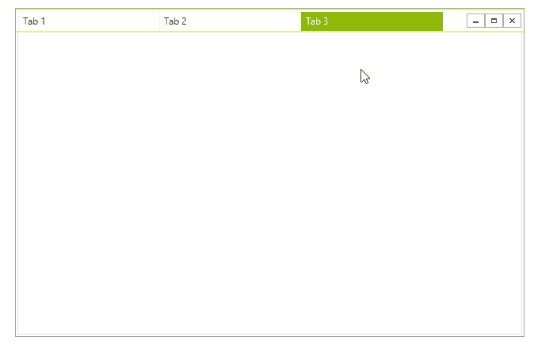
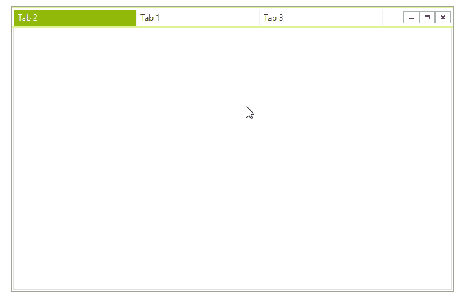
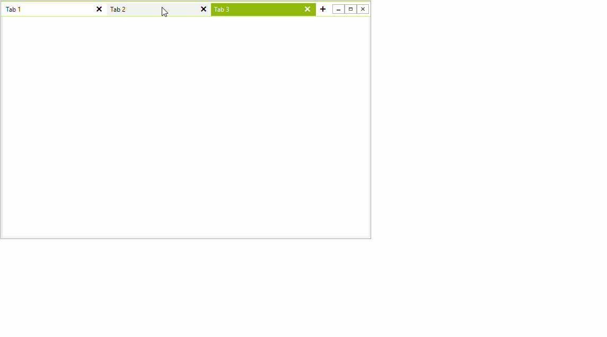
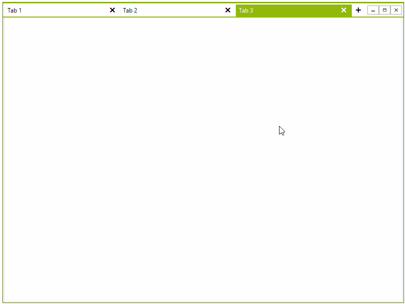

# Drag and Drop

## Drag Drop Service

The **RadTabbedFormControl** is working with a drag-drop service which manages the entire drag-drop operation. The service is exposed by the main element of the control. The **RadTabbedFormDragDropService ** inherits the base [RadDragDropService]() and also exposes two important events providing information when dragging a tab outside of their form results in creating a new form. 

* **TabbedFormCreating**: Gets or Sets the new form which is about to be shown and it also exposes the dragged tab. The event can be canceled.
* **TabbedFormShown**: Gets the tabbed form which also exposes the added **RadTabbedFormControl**.

>important The tabbed control is added to the form in its **Shown** event. If the **TabbedFormControl** property of the form is accessed before showing it, it will return *null*;

#### RadTabbedFormDragDropService

{{source=..\SamplesCS\Forms and Dialogs\TabbedFormCode.cs region=DragDropService}} 
{{source=..\SamplesVB\Forms and Dialogs\TabbedFormCode.vb region=DragDropService}}


{{endregion}} 


## Reordering via Drag and Drop

By default you can reorder the tabs via drag an drop.

>caption Figure 1: Reorder Tabs.




## Detach a tab in a single window. 

By default you can popup any tab in a standalone window. 

>caption Figure 2: Detach Tabs.



## Attach a to the main form

You can attach any stand alone tabbed form to the main form as well.

>caption Figure 3: Attach Tabs.



## Drag Mode

There are three drag modes that are currently supported:
* __Immediate:__ the tabs are moved while dragging.
* __Preview:__ the tab is moved after the mouse is released.
* __None:__ the drag and drop functionality is disabled.

#### Setting the Drag Drop Mode

{{source=..\SamplesCS\Forms and Dialogs\TabbedFormCode.cs region=DragDropMode}} 
{{source=..\SamplesVB\Forms and Dialogs\TabbedFormCode.vb region=DragDropMode}}
````C#
this.TabbedFormControl.ItemDragMode = TabItemDragMode.Preview;

````
````VB.NET
Me.TabbedFormControl.ItemDragMode = TabItemDragMode.Preview

```` 

{{endregion}} 



