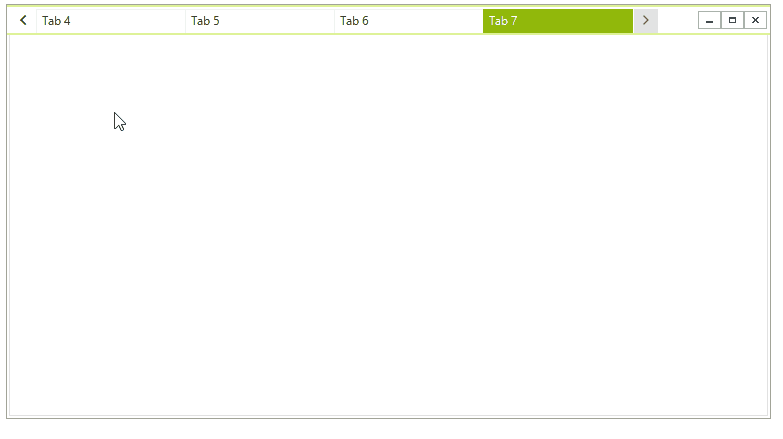

## Navigation

When there is no enough space and not all tabs are visible, two buttons will appear. They will allow you to navigate trough the tabs and select the desired one. 

>caption Figure 1: Tabs Navigation.



>tip The navigation appearance depends of the tabs count, their width and the available space.

If you set the __MinimumTabWidth__ it will affect when the navigation buttons appear as well.

#### Set MinTabWidth

{{source=..\SamplesCS\Forms And Dialogs\TabbedFormCode.cs region=SetMinWidth}} 
{{source=..\SamplesVB\Forms And Dialogs\TabbedFormCode.vb region=SetMinWidth}}
````C#
this.TabbedFormControl.MinimumTabWidth = 150;

````
````VB.NET
Me.TabbedFormControl.MinimumTabWidth = 150

```` 


{{endregion}} 

