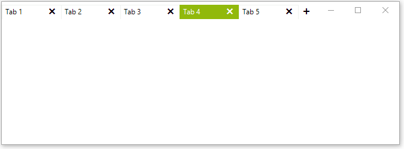

# Pinned Tabs

The tabs can be pinned to the left or right. This will freeze them and they will be always visible. The tabs can be pinned from the context menu or by using the pin button.

>note The left or right position of the pinned tabs is controlled by the [RadTabbedFormControl.PinnedItemsPosition]() property.

## Pin using Context Menu

>caption Figure 1: Pin Tabs From the Context Menu



## Pin using the Button

First you need to show the pin button. Set the **ShowTabPinButton** property to *true*. Set the pin position as well.

#### Show Pin Button

{{source=..\SamplesCS\Forms And Dialogs\TabbedFormCode.cs region=PinProp}} 
{{source=..\SamplesVB\Forms And Dialogs\TabbedFormCode.vb region=PinProp}}
````C#
this.TabbedFormControl.Tabs[0].Item.IsPinned = true;

````
````VB.NET
Me.TabbedFormControl.Tabs(0).Item.IsPinned = True

```` 

{{endregion}} 

>caption Figure 2: Pin Tabs by Using the Pin Button


## Pin Programmatically

You can use the following code to pin a tab.

#### Pin with code


{{source=..\SamplesCS\Forms and Dialogs\TabbedFormCode.cs region=PinTab}} 
{{source=..\SamplesVB\Forms and Dialogs\TabbedFormCode.vb region=PinTab}}
````C#
this.TabbedFormControl.Tabs[0].Item.IsPinned = true;

````
````VB.NET
Me.TabbedFormControl.Tabs(0).Item.IsPinned = True

```` 

{{endregion}} 


