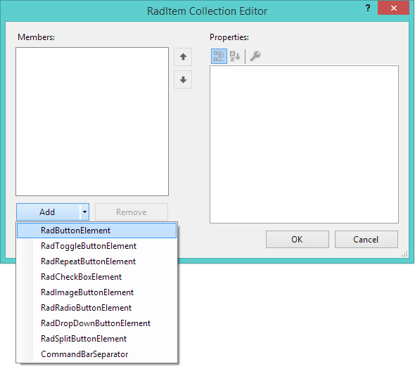

# Quick Actions

By default you can add elements in front of or after the tabs. This can be done at design time or at run-time by accessing the **LeftItems** or **RightItems** collections. Any element inheriting the base **RadItem** class can be added to these collections. 

## Add Items at Design-Time

Buttons can be added directly after typing inside the element with text *Type here* in the Visual Studio designer. 

>caption Figure 1: Add buttons at design time.


Other predefined elements can be added using the Collection Editor of the Left/RightItems collections:

>caption Figure 2: Add Elements in Collection Editor



## Add Items at Run-Time

You can add the buttons in the code behind as well. This is demonstrated in the following example.

#### Adding Buttons Programmatically

{{source=..\SamplesCS\Forms and Dialogs\TabbedFormCode.cs region=Buttons}} 
{{source=..\SamplesVB\Forms and Dialogs\TabbedFormCode.vb region=Buttons}}
````C#
this.TabbedFormControl.LeftItems.Add(new RadButtonElement { Text = "button1" });
this.TabbedFormControl.RightItems.Add(new RadButtonElement { Text = "button2" });

````
````VB.NET
Me.TabbedFormControl.LeftItems.Add(New RadButtonElement With {.Text = "button1"})
Me.TabbedFormControl.RightItems.Add(New RadButtonElement With {.Text = "button2"})

```` 

{{endregion}} 

>caption Figure 1:Adding Buttons Programmatically.


