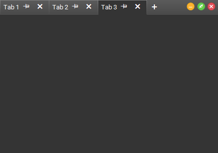
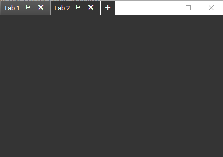

# Standard Styles

The tabs can shown when the form is showing the standard windows window styles. This is controlled by the __AllowAero__ property. 


{{source=..\SamplesCS\Forms and Dialogs\TabbedFormCode.cs region=Aero}} 
{{source=..\SamplesVB\Forms and Dialogs\TabbedFormCode.vb region=Aero}}
````C#
````
````VB.NET
```` 

{{endregion}} 


>caption Figure 1: AllowAero = false



>caption Figure 1: AllowAero = true


