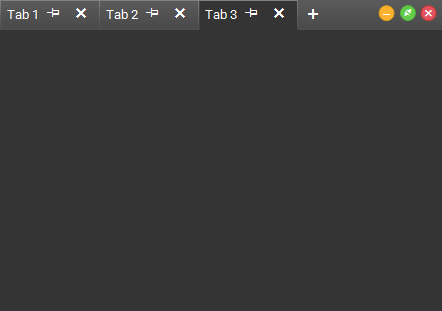
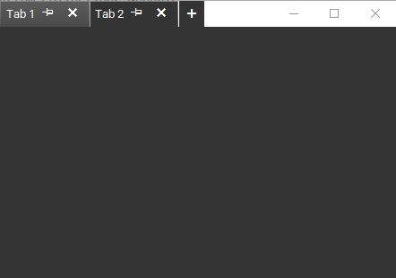

# Title Bar Style

The Tabbed Form supports the standard Windows title bar style. This setting is controlled by the __AllowAero__ property.

<snippet id='tabbedform-tabbedformcode-aero-cs' />
<snippet id='tabbedform-tabbedformcode-aero-vb' />

>caption Figure 1: AllowAero = false on Windows 10

>caption Figure 2: AllowAero = true on Windows 10

