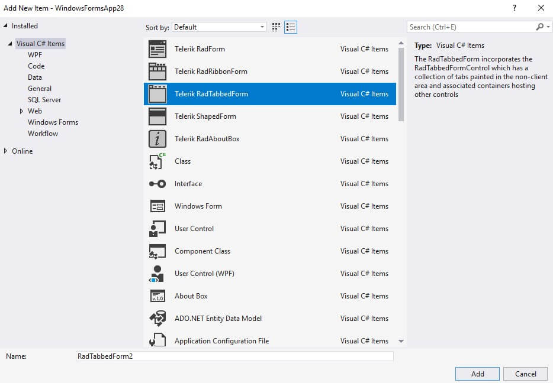
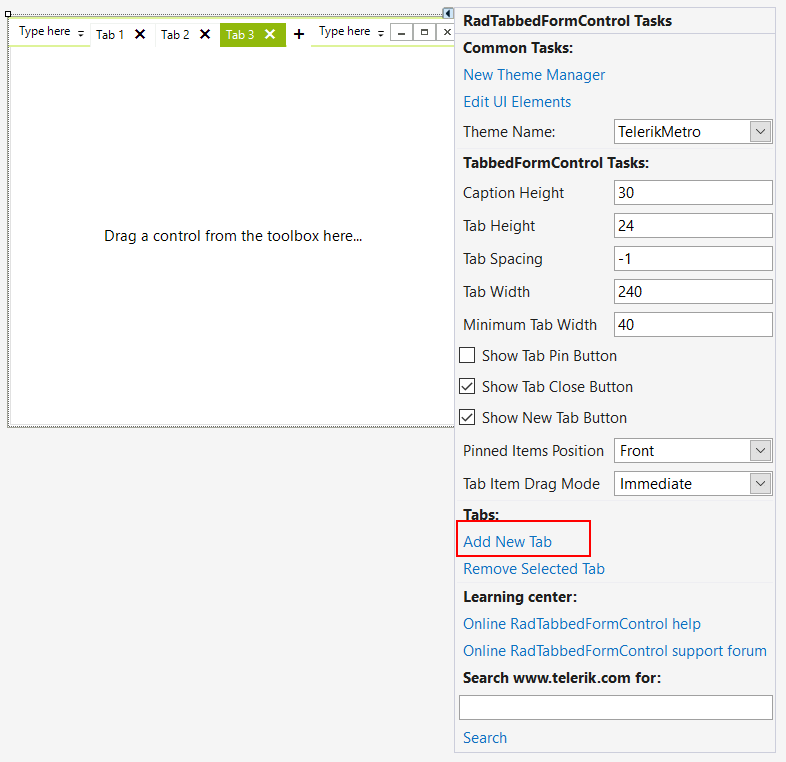
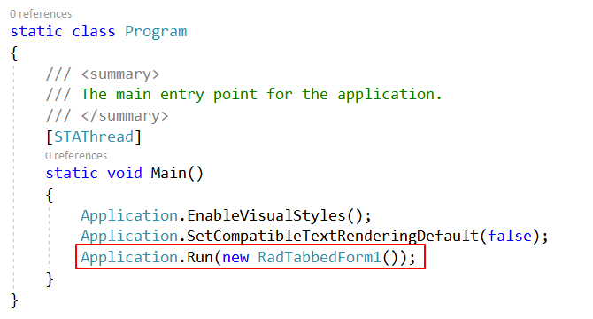
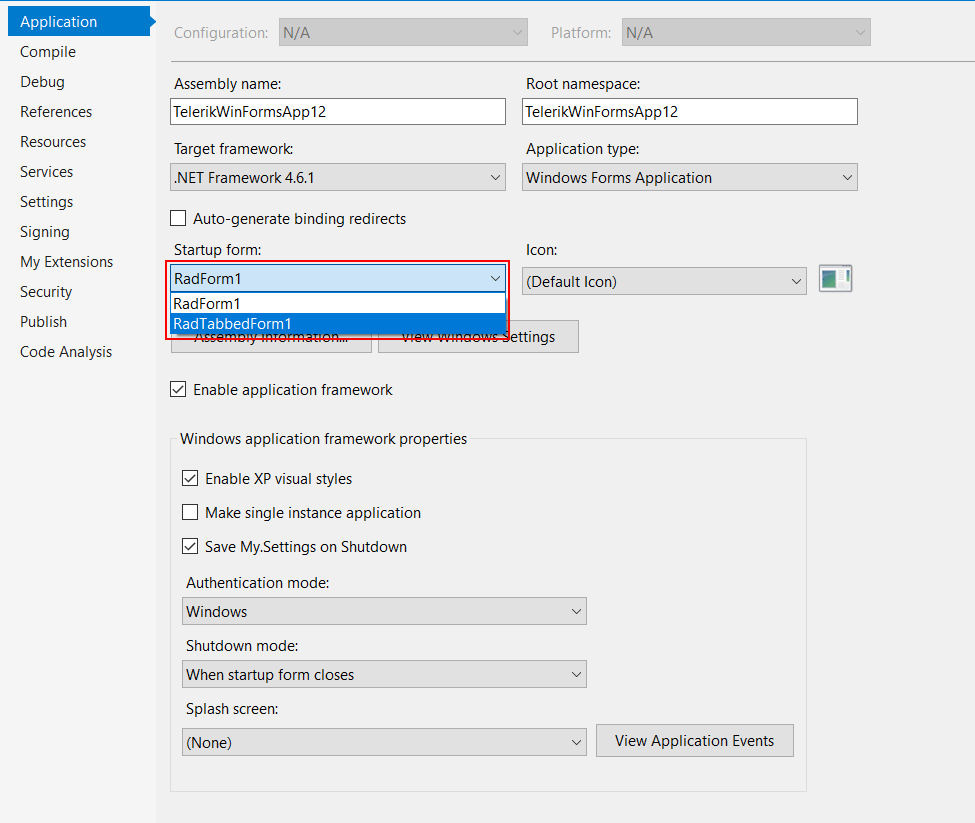
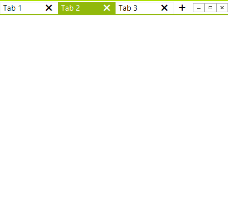

## Getting Started

This topic will walk you through the creating process of __RadTabbedForm__.

1\. Create a blank new Telerik Winforms application using the standard template. 

2\. Add a new Tabbed form from Visual Studio. Go to __Project -> Add Windows Form__ and then select TabbedForm

3\. Add some tabs from the Smart Tag.

4\. Go to the Program.cs and change the startup form. 

In VB.NET this can be done from the project properties.

5\. Start the application. 

# See Also

* [Structure]()
* [Design Time]()
* [How to Hide the New Tab Button for the Popped out Forms]()
