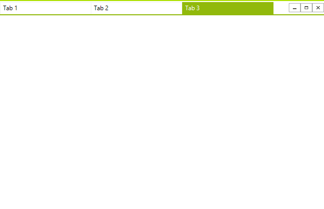

# Overview

__RadTabbedForm__ allows you to display a tabs in the title bar, just like in most modern Web browsers. You can place buttons or other elements in front or after the tabs. You can pin the tabs or reorder the via drag drop. You can open any tab in a standalone window as well.   

## Key Features

* Display tabs in the title bar
* Tabs can be added at run-time and at design-time
* Tabs reorder via drag-drop
* Pop-up a tab in a separate window via drag drop
* Show an icon in the tab
* Add buttons to in front or after the tabs
* Context menu
* Pinned items
* Adjustable caption height
* Supports standard Windows title bar styles

# See Also

* [Structure]()
* [Getting Started]()
* [Design Time]()
 