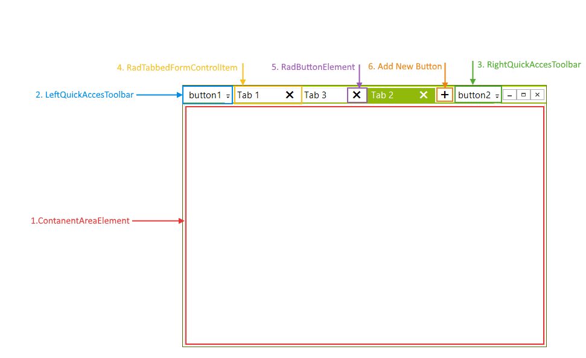
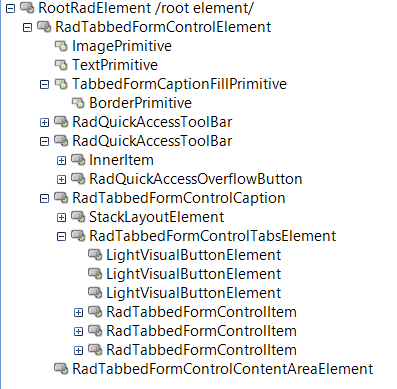

**RadTabbedForm** is a wrapper of the **RadTabbedFormControl**. The tabbed control is docked to *Fill* and it is the sole child control of the **RadTabbedForm**. This article explains the inner structure of the **RadTabbedFormControl**.    

## Structure

>caption Figure: 1 The elements of RadTabbedFormControl

## Elements Hierarchy

>caption Figure: 2 The elements hierarchy

# See Also

* [Getting Started]()
* [Design Time]()