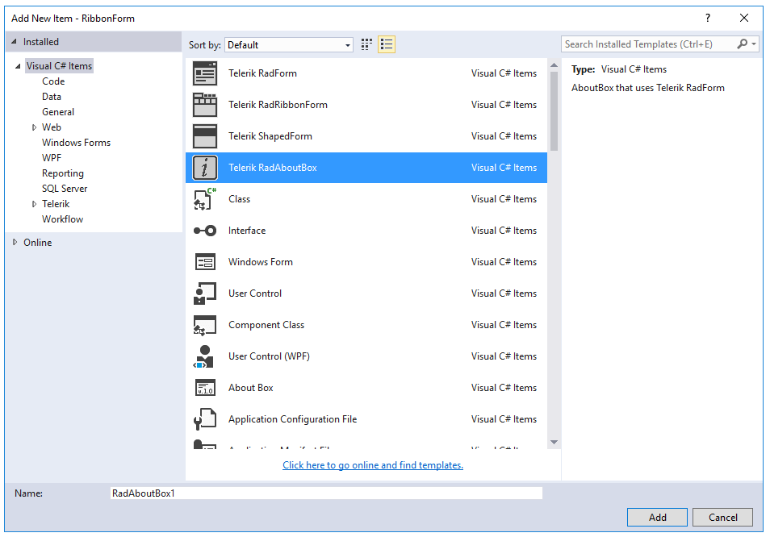

# Templates

The Visual Studio templates that install with Telerik UI for WinForms let you add [RadForm]() and [ShapedForm]() to your application without any coding steps. There are also two other specialized forms, __RadRibbonForm__ that contains a built-in __RadRibbonBar__ and __RadAboutBox__ that is an enhanced, themeable version of the regular AboutBox.




        

