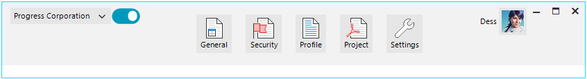

# Adding Items Programmatically

**RadToolbarForm** allows adding items either at [design time]() or programmatically. This article shows how to add elements to the *near*, *center* and *far* parts of the **RadToolbarFormControl**:

 

{{source=..\SamplesCS\Forms and Dialogs\RadToolbarForm1.cs region=AddItems}} 
{{source=..\SamplesVB\Forms and Dialogs\RadToolbarForm1.vb region=AddItems}}

````C#

RadDropDownButtonElement dropDownBtn = new RadDropDownButtonElement() { Text = "Progress Corporation" };
dropDownBtn.Items.Add(new RadMenuItem("UI for WinForms"));
dropDownBtn.Items.Add(new RadMenuItem("UI for WPF"));
this.ToolbarFormControl.NearItems.Add(dropDownBtn);

RadToggleSwitchElement toggleSwitch = new RadToggleSwitchElement() { MinSize = new Size(40, 0), Margin = new Padding(1) };
this.ToolbarFormControl.NearItems.Add(toggleSwitch);

RadButtonElement generalBtn = new RadButtonElement()
{
    Text = "General",
    SvgImageXml = Properties.Resources.document_text_table,
    TextImageRelation = TextImageRelation.ImageAboveText,
    ImageAlignment = ContentAlignment.TopCenter,
    Margin = new Padding(10)
};
this.ToolbarFormControl.CenterItems.Add(generalBtn);

RadButtonElement securityBtn = new RadButtonElement()
{
    Text = "Security",
    SvgImageXml = Properties.Resources.document_flag,
    TextImageRelation = TextImageRelation.ImageAboveText,
    ImageAlignment = ContentAlignment.TopCenter,
    Margin = new Padding(10)
};
this.ToolbarFormControl.CenterItems.Add(securityBtn);

RadButtonElement profileBtn = new RadButtonElement()
{
    Text = "Profile",
    SvgImageXml = Properties.Resources.document_text,
    TextImageRelation = TextImageRelation.ImageAboveText,
    ImageAlignment = ContentAlignment.TopCenter,
    Margin = new Padding(10)
};
this.ToolbarFormControl.CenterItems.Add(profileBtn);

RadButtonElement projectBtn = new RadButtonElement()
{
    Text = "Project",
    SvgImageXml = Properties.Resources.document_pdf,
    TextImageRelation = TextImageRelation.ImageAboveText,
    ImageAlignment = ContentAlignment.TopCenter,
    Margin = new Padding(10)
};
this.ToolbarFormControl.CenterItems.Add(projectBtn);

RadButtonElement settingsBtn = new RadButtonElement()
{
    Text = "Settings",
    SvgImageXml = Properties.Resources.tool_wrench,
    TextImageRelation = TextImageRelation.ImageAboveText,
    ImageAlignment = ContentAlignment.TopCenter,
    Margin = new Padding(10)
};
this.ToolbarFormControl.CenterItems.Add(settingsBtn);

this.ToolbarFormControl.FarItems.Add(new RadLabelElement() { Text = "Dess" });
this.ToolbarFormControl.FarItems.Add(new RadButtonElement()
{
    Image = Properties.Resources.dess_avatar32,
    DisplayStyle = DisplayStyle.Image
});


````
````VB.NET

Dim dropDownBtn As RadDropDownButtonElement = New RadDropDownButtonElement() With {
Text = "Progress Corporation"}
dropDownBtn.Items.Add(New RadMenuItem("UI for WinForms"))
dropDownBtn.Items.Add(New RadMenuItem("UI for WPF"))
Me.ToolbarFormControl.NearItems.Add(dropDownBtn)

Dim toggleSwitch As RadToggleSwitchElement = New RadToggleSwitchElement() With {
    .MinSize = New Size(40, 0),
    .Margin = New Padding(1)
}
Me.ToolbarFormControl.NearItems.Add(toggleSwitch)
Dim generalBtn As RadButtonElement = New RadButtonElement() With {
    .Text = "General",
    .SvgImageXml = My.Resources.document_text_table,
    .TextImageRelation = TextImageRelation.ImageAboveText,
    .ImageAlignment = ContentAlignment.TopCenter,
    .Margin = New Padding(10)
}
Me.ToolbarFormControl.CenterItems.Add(generalBtn)
Dim securityBtn As RadButtonElement = New RadButtonElement() With {
    .Text = "Security",
    .SvgImageXml = My.Resources.document_flag,
    .TextImageRelation = TextImageRelation.ImageAboveText,
    .ImageAlignment = ContentAlignment.TopCenter,
    .Margin = New Padding(10)
}
Me.ToolbarFormControl.CenterItems.Add(securityBtn)
Dim profileBtn As RadButtonElement = New RadButtonElement() With {
    .Text = "Profile",
    .SvgImageXml = My.Resources.document_text,
    .TextImageRelation = TextImageRelation.ImageAboveText,
    .ImageAlignment = ContentAlignment.TopCenter,
    .Margin = New Padding(10)
}
Me.ToolbarFormControl.CenterItems.Add(profileBtn)
Dim projectBtn As RadButtonElement = New RadButtonElement() With {
    .Text = "Project",
    .SvgImageXml = My.Resources.document_pdf,
    .TextImageRelation = TextImageRelation.ImageAboveText,
    .ImageAlignment = ContentAlignment.TopCenter,
    .Margin = New Padding(10)
}
Me.ToolbarFormControl.CenterItems.Add(projectBtn)
Dim settingsBtn As RadButtonElement = New RadButtonElement() With {
    .Text = "Settings",
    .SvgImageXml = My.Resources.tool_wrench,
    .TextImageRelation = TextImageRelation.ImageAboveText,
    .ImageAlignment = ContentAlignment.TopCenter,
    .Margin = New Padding(10)
}
Me.ToolbarFormControl.CenterItems.Add(settingsBtn)
Me.ToolbarFormControl.FarItems.Add(New RadLabelElement() With {
    .Text = "Dess"
})
Me.ToolbarFormControl.FarItems.Add(New RadButtonElement() With {
    .Image = My.Resources.dess_avatar32,
    .DisplayStyle = DisplayStyle.Image
})

```` 

{{endregion}} 

## See Also

* [Structure]()
* [Design Time]()