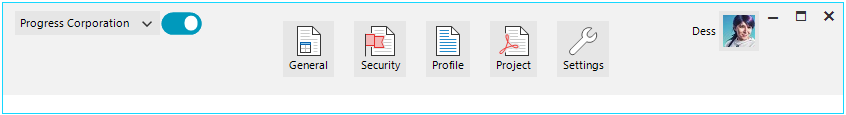

# Adding Items Programmatically

**RadToolbarForm** allows adding items either at [design time]() or programmatically. This article shows how to add elements to the *near*, *center* and *far* parts of the **RadToolbarFormControl**:

 

<snippet id='toolbarform-radtoolbarform1-additems-cs' />
<snippet id='toolbarform-radtoolbarform1-additems-vb' />

 

## See Also

* [Structure]()
* [Design Time]()