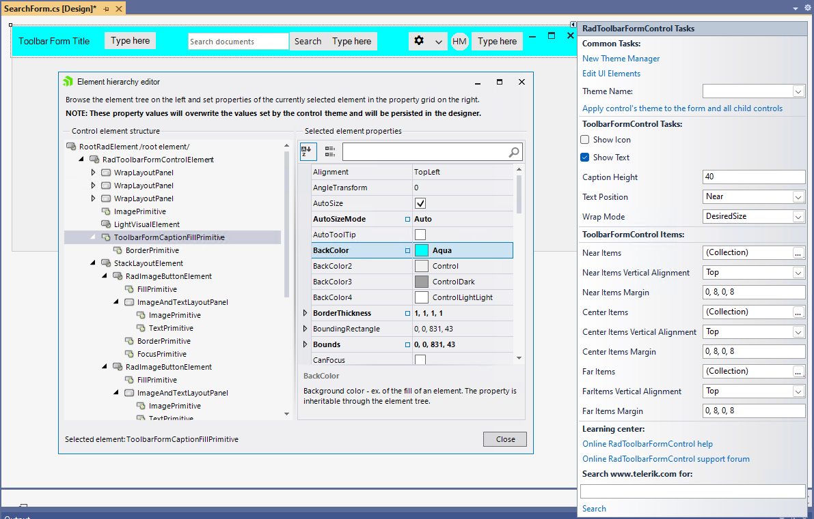
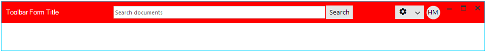

## Customizing Appearance

### Design Time

You can access and modify the style for the different elements in the **RadToolbarFormControl** by using the *Element hierarchy editor*. Select RadToolbarFormControl and click the small arrow on the top right position in order to open the Smart Tag. Then, select the *Edit UI Elements* option:

 

### Programmatically

The following example demonstrates how you can access the **CaptionFill** and change its back color.

{{source=..\SamplesCS\Forms and Dialogs\RadToolbarForm1.cs region=CustomizeStyle}} 
{{source=..\SamplesVB\Forms and Dialogs\RadToolbarForm1.vb region=CustomizeStyle}}

````C#

this.ToolbarFormControl.ToolbarFormControlElement.CaptionFill.BackColor = Color.Red;
this.ToolbarFormControl.ToolbarFormControlElement.CaptionFill.GradientStyle = GradientStyles.Solid;
this.ToolbarFormControl.ToolbarFormControlElement.CaptionTextElement.ForeColor = Color.White;

````
````VB.NET

Me.ToolbarFormControl.ToolbarFormControlElement.CaptionFill.BackColor = Color.Red
Me.ToolbarFormControl.ToolbarFormControlElement.CaptionFill.GradientStyle = GradientStyles.Solid
Me.ToolbarFormControl.ToolbarFormControlElement.CaptionTextElement.ForeColor = Color.White

```` 

{{endregion}} 



# See Also

* [Structure]()
* [Design Time]()
* [Adding Items Programmatically]()