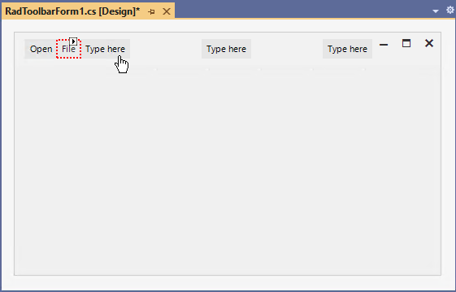
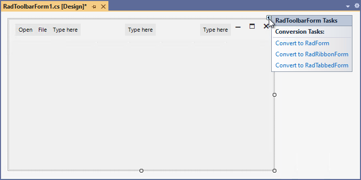
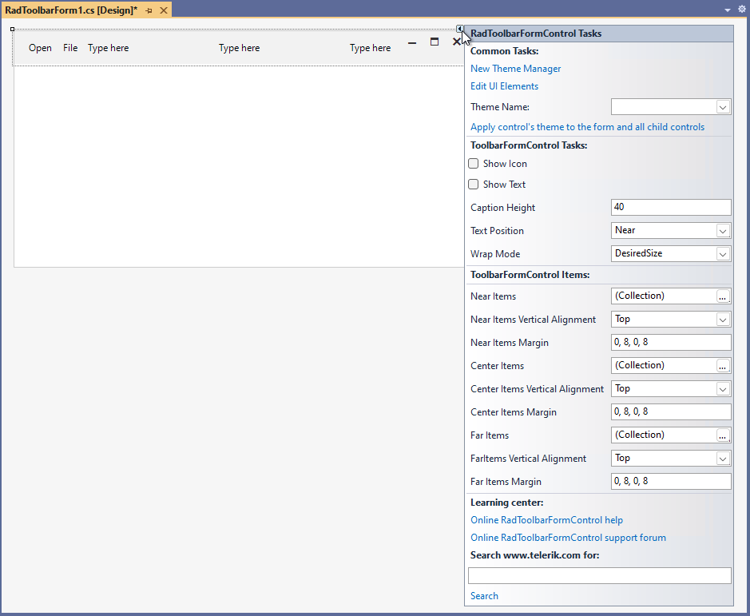
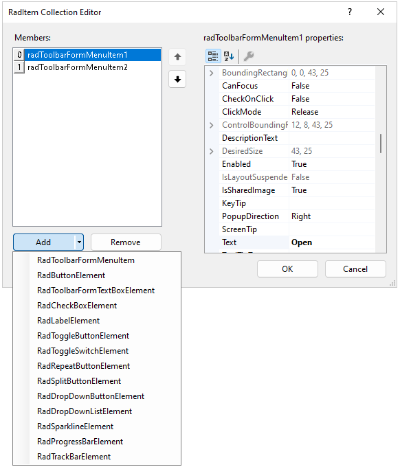

# Design Time 

At design time you can directly type on the left, middle or right part to add **RadToolbarFormMenuItem**.

>caption Figure 1: RadToolbarForm add items to the left,middle or right.

## RadToolbarForm's Smart Tag

Select RadToolbarForm and click the small arrow on the top right position in order to open the Smart Tag. It allows you to convert it to a RadForm, RadRibbonForm or RadTabbedForm.

>caption Figure 2: RadToolbarForm's smart tag.

## RadToolbarFormControl's Smart Tag

Select RadToolbarFormControl and click the small arrow on the top right position in order to open the Smart Tag.

* **Common Tasks**
    - **New Theme Manager**: Adds a new **RadThemeManager** component to the form.
    - **Edit UI elements**: Opens a dialog that displays the **Element Hierarchy Editor**. This editor lets you browse all the elements in the control.
    - **Theme Name**: Select a theme name from the drop down list of themes available for that control. Selecting a theme allows you to change all aspects of the controls visual style at one time.
* **ToolbarFormControl Tasks**
    - **Show Icon**: Gets or sets a value indicating whether an icon is displayed in the caption bar of the form.
    - **Show Text**: Gets or sets whether the element holding the text is visible.
    - **Caption Height**: Gets or sets the height of the extended title bar.
    - **Text Position**: Gets or sets the position of the text inside the title bar.
    - **Wrap Mode**: Determines how the element containers are wrapped in relation to the available space.
    - __Pinned Items Position:__ Set the position of the pinned tabs.
    - __Tab Item Drag Mode:__ Set the drag drop mode.
* **ToolbarFormControl Items**
    - **Near Items**: Stores the near toolbar items.
    - **Near Items Vertical Alignment**: Gets or sets the vertical alignment of the near toolbar items.
    - **Near Items Margin**: Gets or sets the margin that defines the margin of the WrapLayoutPanel holding the near items.
    - **Center Items**: Stores the center toolbar items.
    - **Center Items Vertical Alignment**: Gets or sets the vertical alignment of the center toolbar items.
    - **Center Items Margin**: Gets or sets the margin that defines the margin of the WrapLayoutPanel holding the center items.
    - **Far Items**: Stores the far toolbar items.
    - **Far Items Vertical Alignment**: Gets or sets the vertical alignment of the far toolbar items.
    - **Far Items Margin**: Gets or sets the margin that defines the margin of the WrapLayoutPanel holding the far items.
    
The **Near Items**, **Center Items** and **Far Items** options open the *RadItem Collection Editor* allowing you to add the desired items:

* __Learning Center:__ Navigate to the Telerik help, code library projects or support forum.
* __Search:__ Search the Telerik site for a given string.

# See Also

* [Structure]()
* [Getting Started]()