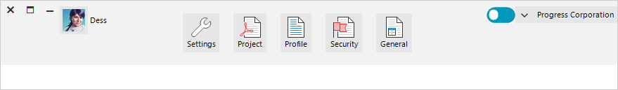

# Right-To-Left

**RadToolbarForm** offers full support for right-to-left cultures. By default, your RadToolbarForm layout will be left-to-right. In the screenshot below, however, the **RightToLeft** property of RadToolbarForm is set to **Yes** and the form's title bar is drawn from right to left:

## See Also

* [Structure]()
* [Design Time]()