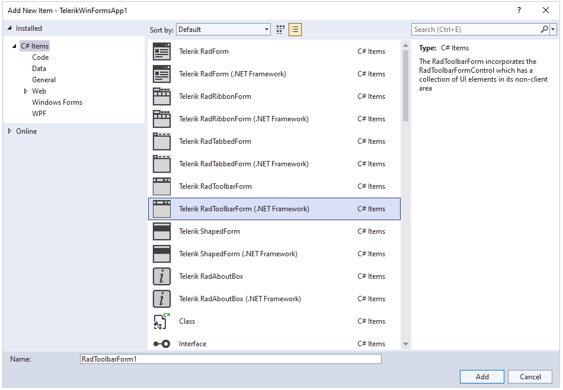

# Getting Started

This topic will walk you through the creating process of RadToolbarForm.

1\. Create a blank new Telerik Winforms application using the standard template. 

2\. Add a new Toolbar form from Visual Studio. Go to __Project -> Add Windows Form__ and then select ToolbarForm.

3\. From the __Smart Tag__ we can populate each of the three sections of the RadToolbarForm.

4\. From the __Collection Editor__ window you can choose from a variety of elements to populate each of the three sections of the control.

5\. Go to the Program.cs and change the startup form. 

In VB.NET this can be done from the project properties.

5\. Start the application.

## See Also

* [Structure]()
* [Design Time]()