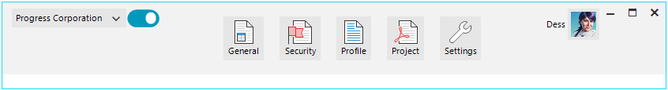

# RadToolbarForm

**RadToolbarForm** allows you to build modern UI. Having items in the non-client area of the window is crucial to saving valuable space. With RadToolbarForm, you will be able to create modern applications that can mimic the Visual Studio title bar experience, thanks to the ability to add buttons, drop-down menus, text boxes and more.   





## Key Features

* Straight-forward API for adding various UI elements - labels, buttons, text boxes, etc.
* Adjustable height of the title bar.
* Horizontally separated title bar into three areas: Left, Middle, and Right.
* Right-to-Left support.
* Predefined text position.

# See Also

* [Structure]()
* [Getting Started]()
* [Design Time]()

