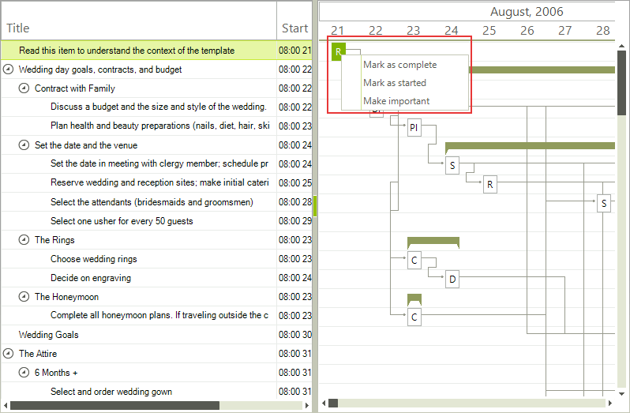
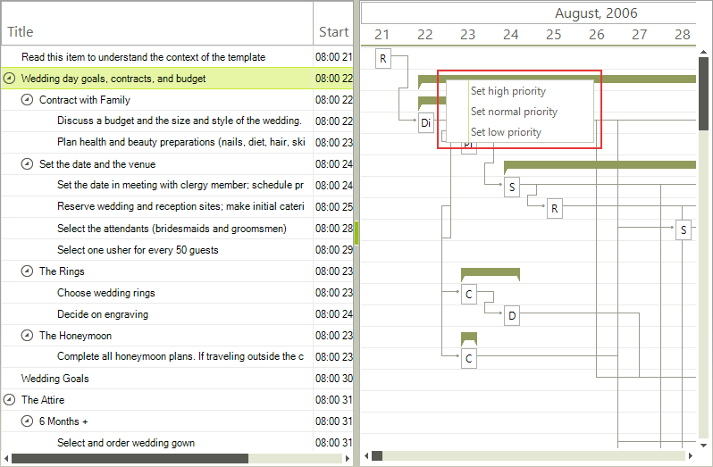

# Data item context menu

__RadGanttView__ allows you to assign an individual context menu on each data item. This context menu is with higher priority than the default context menu so if you have assigned such a context menu it will be displayed even if you have not disabled the default context menu.
       
{{source=..\SamplesCS\GanttView\ContextMenus\ItemContextMenu.cs region=ItemContextMenu}} 
{{source=..\SamplesVB\GanttView\ContextMenus\ItemContextMenu.vb region=ItemContextMenu}} 

````C#
RadContextMenu contextMenu1 = new RadContextMenu();
contextMenu1.Items.Add(new GanttViewMenuItem("complete", "Mark as complete"));
contextMenu1.Items.Add(new GanttViewMenuItem("started", "Mark as started"));
contextMenu1.Items.Add(new GanttViewMenuItem("important", "Make important"));
RadContextMenu contextMenu2 = new RadContextMenu();
contextMenu2.Items.Add(new GanttViewMenuItem("high", "Set high priority"));
contextMenu2.Items.Add(new GanttViewMenuItem("normal", "Set normal priority"));
contextMenu2.Items.Add(new GanttViewMenuItem("low", "Set low priority"));
this.radGanttView1.Items[0].ContextMenu = contextMenu1;
this.radGanttView1.Items[0].Items[0].ContextMenu = contextMenu2;

````
````VB.NET
Dim ContextMenu1 As RadContextMenu = New RadContextMenu()
ContextMenu1.Items.Add(New GanttViewMenuItem("complete", "Mark as complete"))
ContextMenu1.Items.Add(New GanttViewMenuItem("started", "Mark as started"))
ContextMenu1.Items.Add(New GanttViewMenuItem("important", "Make important"))
Dim ContextMenu2 As RadContextMenu = New RadContextMenu()
contextMenu2.Items.Add(New GanttViewMenuItem("high", "Set high priority"))
contextMenu2.Items.Add(New GanttViewMenuItem("normal", "Set normal priority"))
contextMenu2.Items.Add(New GanttViewMenuItem("low", "Set low priority"))
Me.radGanttView1.Items(0).ContextMenu = ContextMenu1
Me.radGanttView1.Items(0).Items(0).ContextMenu = ContextMenu2

````

{{endregion}} 






# See Also

* [Modifying context menu]()
* [Default context menu]()
