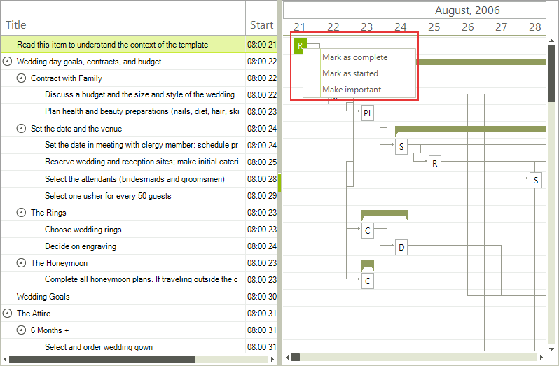
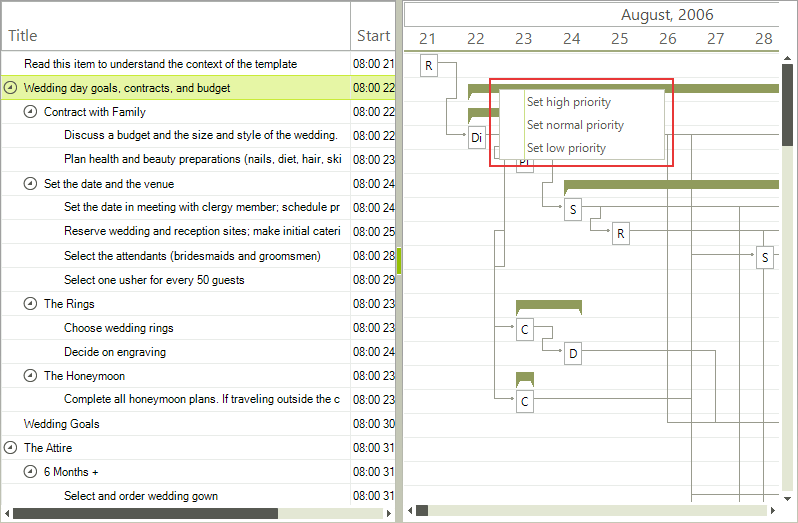

# Data item context menu

__RadGanttView__ allows you to assign an individual context menu on each data item. This context menu is with higher priority than the default context menu so if you have assigned such a context menu it will be displayed even if you have not disabled the default context menu.
       
<snippet id='ganttview-itemcontextmenu-itemcontextmenu-cs' />
<snippet id='ganttview-itemcontextmenu-itemcontextmenu-vb' />

# See Also

* [Modifying context menu]()
* [Default context menu]()
