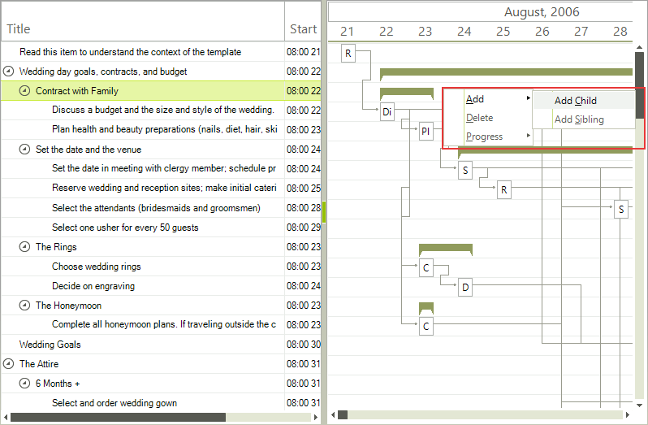
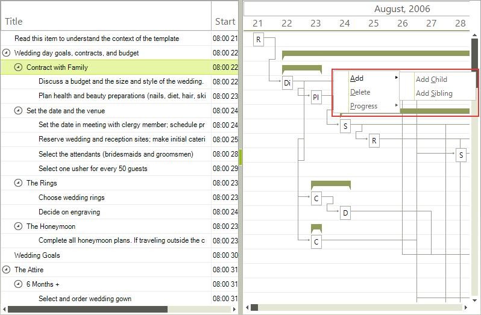
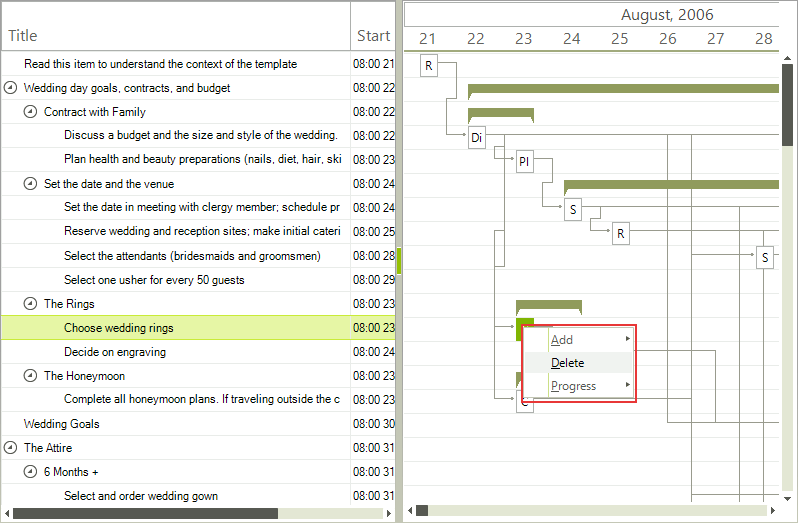
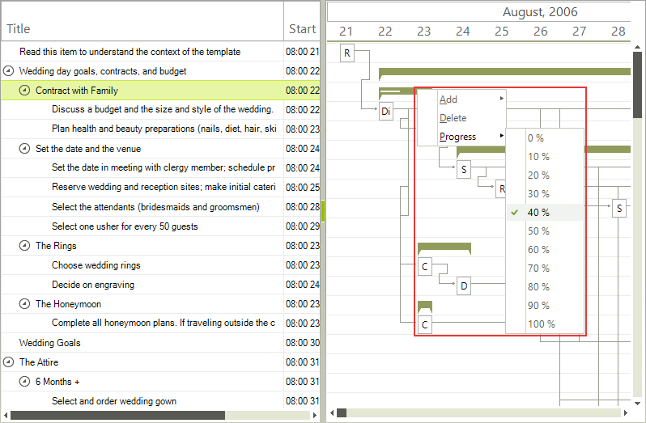

# Default context menu

__RadGanttView__ has a default context menu which allows several operations with the gantt data items to be performed.

## Add

The __Add__ option offers two ways to add an item. You can add an item on the same level as the item you clicked on or you can add a new child to the item you clicked on.

Adding a child will add it at the last position in the parent task __Items__ collection.

>caption  Figure 1: Add new item with the context menu.

Adding a sibling will add it before the item you clicked on.

>caption Figure 2: Add sibling items with the context menu.

## Delete

The __Delete__ option does exactly what you would expect it to. It deletes the item you have clicked on. It also removes any child items.

>caption Figure 3: The Delete Menu Item.  

## Progress

The __Progress__ option allows you to set the progress of a task to a certain value. You can modify the step at which the progress menu items increase and thus their number through the __ProgressStep__ property of the context menu. Also you can control whether this option should appear at all through the __ShowProgress__ property. If the item current progress is not a multiple of the progress step the value is automatically added in the appropriate position of the menu items.

>caption Figure 4: Setting the progress with the context menu.
        

# See Also

* [Data item context menu]()
* [Modifying context menu]()
