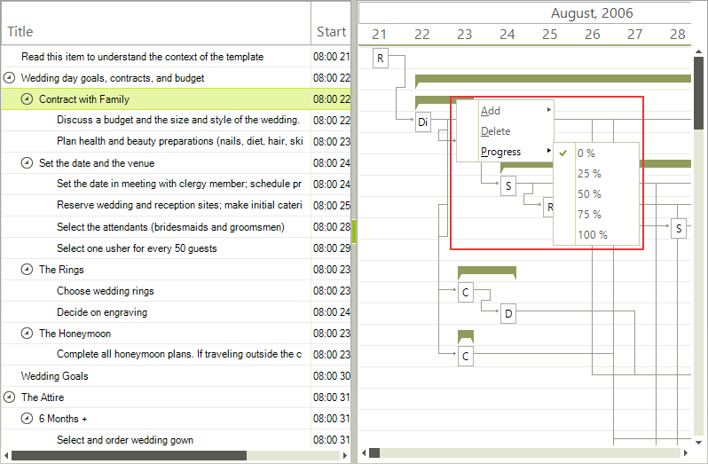

# Modifying Context Menu

When a context menu in __RadGanttView__ is about to be opened the __ContextMenuOpening__ event is fired. This event allows you to customize the items shown in the context menu.

The event arguments have the following properties:

* __Item__ – the item for which a menu is about to be opened.

* __Menu__ – the menu that will be shown.

* __Cancel__ – allows you to stop the showing of the menu. Set this property to true to cancel the opening.

Here is an example which demonstrates how to change the progress step of the default context menu.
         
<snippet id='ganttview-modifyingcontextmenu-modifyingcontextmenu-cs' />
<snippet id='ganttview-modifyingcontextmenu-modifyingcontextmenu-vb' />

# See Also

* [Data item context menu]()
* [Default context menu]()
