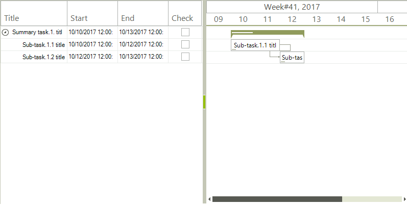

# Custom Data Cells

**RadGanttView** allows you to replace the standard cells displayed in the text view with custom ones. The following example demonstrates how to add a custom cell element having a check box.

>caption Figure 1: Checkbox Cell 



#### Custom Cell Implementation

{{source=..\SamplesCS\GanttView\CustomItems\GanttCheckBoxForm.cs region=CustomCellClass}} 
{{source=..\SamplesVB\GanttView\CustomItems\GanttCheckBoxForm.vb region=CustomCellClass}}
````C#
public class CustomGanttViewTextViewCellElement : GanttViewTextViewCellElement
{
    private RadCheckBoxElement checkBox;
    public CustomGanttViewTextViewCellElement(GanttViewTextItemElement owner, GanttViewTextViewColumn column)
        : base(owner, column)
    { }
    protected override Type ThemeEffectiveType
    {
        get { return typeof(GanttViewTextViewCellElement); }
    }
    protected override void CreateChildElements()
    {
        base.CreateChildElements();
        this.checkBox = new RadCheckBoxElement();
        this.checkBox.CheckStateChanged += CheckBox_CheckStateChanged;
        this.Children.Add(this.checkBox);
    }
    protected override SizeF ArrangeOverride(SizeF finalSize)
    {
        SizeF size = base.ArrangeOverride(finalSize);
        this.checkBox.Arrange(new RectangleF(new PointF((size.Width - this.checkBox.CheckMarkPrimitive.Size.Width) / 2, 0), this.checkBox.Size));
        return size;
    }
    private void CheckBox_CheckStateChanged(object sender, EventArgs e)
    {
        GanttViewTextItemElement owner = this.Owner as GanttViewTextItemElement;
        owner.Data.Tag = this.checkBox.Checked;
    }
}

````
````VB.NET
Public Class CustomGanttViewTextViewCellElement
    Inherits GanttViewTextViewCellElement
    Private checkBox As RadCheckBoxElement
    Public Sub New(owner As GanttViewTextItemElement, column As GanttViewTextViewColumn)
        MyBase.New(owner, column)
    End Sub
    Protected Overrides ReadOnly Property ThemeEffectiveType() As Type
        Get
            Return GetType(GanttViewTextViewCellElement)
        End Get
    End Property
    Protected Overrides Sub CreateChildElements()
        MyBase.CreateChildElements()
        Me.checkBox = New RadCheckBoxElement()
        AddHandler Me.checkBox.CheckStateChanged, AddressOf CheckBox_CheckStateChanged
        Me.Children.Add(Me.checkBox)
    End Sub
    Protected Overrides Function ArrangeOverride(finalSize As SizeF) As SizeF
        Dim size As SizeF = MyBase.ArrangeOverride(finalSize)
        Me.checkBox.Arrange(New RectangleF(New PointF((size.Width - Me.checkBox.CheckMarkPrimitive.Size.Width) / 2, 0), Me.checkBox.Size))
        Return size
    End Function
    Private Sub CheckBox_CheckStateChanged(sender As Object, e As EventArgs)
        Dim owner As GanttViewTextItemElement = TryCast(Me.Owner, GanttViewTextItemElement)
        owner.Data.Tag = Me.checkBox.Checked
    End Sub
End Class

````


{{endregion}} 

The events which need to be handled are:
 
 * **DataCellElementCreating**: The custom cell element will be initialized in the event handler.
 * **ItemEditing**: The actual cell editing will be performed by the custom cell element with the check box. The event needs to be canceled so that the default editor will not initialize.

#### Handling Events

{{source=..\SamplesCS\GanttView\CustomItems\GanttCheckBoxForm.cs region=HandleEvents}} 
{{source=..\SamplesVB\GanttView\CustomItems\GanttCheckBoxForm.vb region=HandleEvents}}
````C#
private void GanttViewElement_ItemEditing(object sender, GanttViewItemEditingEventArgs e)
{
    if (e.Column.FieldName == "Check")
    {
        e.Cancel = true;
    }
}
private void radGanttView1_DataCellElementCreating(object sender, GanttViewDataCellElementCreatingEventArgs e)
{
    if (e.CellElement.Data.HeaderText == "Check")
    {
        e.CellElement = new CustomGanttViewTextViewCellElement(e.CellElement.Owner, e.CellElement.Column);
    }
}

````
````VB.NET
Private Sub GanttViewElement_ItemEditing(sender As Object, e As GanttViewItemEditingEventArgs)
    If e.Column.FieldName = "Check" Then
        e.Cancel = True
    End If
End Sub
Private Sub radGanttView1_DataCellElementCreating(sender As Object, e As GanttViewDataCellElementCreatingEventArgs)
    If e.CellElement.Data.HeaderText = "Check" Then
        e.CellElement = New CustomGanttViewTextViewCellElement(e.CellElement.Owner, e.CellElement.Column)
    End If
End Sub

````


{{endregion}}

The data can be added to the control in the **OnLoad** method of the form. It is important to also add "*Check*" column in which the custom cell will be displayed.   

#### Initial Setup

{{source=..\SamplesCS\GanttView\CustomItems\GanttCheckBoxForm.cs region=InitialSetup}} 
{{source=..\SamplesVB\GanttView\CustomItems\GanttCheckBoxForm.vb region=InitialSetup}}
````C#
protected override void OnLoad(EventArgs e)
{
    base.OnLoad(e);
    this.radGanttView1.GanttViewElement.ItemEditing += GanttViewElement_ItemEditing;
    this.radGanttView1.DataCellElementCreating += radGanttView1_DataCellElementCreating;
    this.radGanttView1.GanttViewElement.GraphicalViewElement.TimelineStart = new DateTime(2017, 10, 9);
    this.radGanttView1.GanttViewElement.GraphicalViewElement.TimelineEnd = new DateTime(2017, 10, 20);
    this.BindData();
}
private void BindData()
{
    GanttViewDataItem item1 = new GanttViewDataItem();
    item1.Start = new DateTime(2017, 10, 10);
    item1.End = new DateTime(2017, 10, 13);
    item1.Progress = 30m;
    item1.Title = "Summary task.1. title";
    GanttViewDataItem subitem11 = new GanttViewDataItem();
    subitem11.Start = new DateTime(2017, 10, 10);
    subitem11.End = new DateTime(2017, 10, 12);
    subitem11.Tag = "Custom";
    subitem11.Progress = 10m;
    subitem11.Title = "Sub-task.1.1 title";
    GanttViewDataItem subitem12 = new GanttViewDataItem();
    subitem12.Start = new DateTime(2017, 10, 12);
    subitem12.End = new DateTime(2017, 10, 13);
    subitem12.Progress = 20m;
    subitem12.Title = "Sub-task.1.2 title";
    item1.Items.Add(subitem11);
    item1.Items.Add(subitem12);
    this.radGanttView1.Items.Add(item1);
    GanttViewLinkDataItem link1 = new GanttViewLinkDataItem();
    link1.StartItem = subitem11;
    link1.EndItem = subitem12;
    link1.LinkType = TasksLinkType.FinishToStart;
    this.radGanttView1.Links.Add(link1);
    GanttViewTextViewColumn titleColumn = new GanttViewTextViewColumn("Title");
    GanttViewTextViewColumn startColumn = new GanttViewTextViewColumn("Start");
    GanttViewTextViewColumn endColumn = new GanttViewTextViewColumn("End");
    GanttViewTextViewColumn checkColumn = new GanttViewTextViewColumn("Check");
    this.radGanttView1.GanttViewElement.Columns.Add(titleColumn);
    this.radGanttView1.GanttViewElement.Columns.Add(startColumn);
    this.radGanttView1.GanttViewElement.Columns.Add(endColumn);
    this.radGanttView1.GanttViewElement.Columns.Add(checkColumn);
}

````
````VB.NET
Protected Overrides Sub OnLoad(e As EventArgs)
    MyBase.OnLoad(e)
    AddHandler Me.radGanttView1.GanttViewElement.ItemEditing, AddressOf GanttViewElement_ItemEditing
    AddHandler Me.radGanttView1.DataCellElementCreating, AddressOf radGanttView1_DataCellElementCreating
    Me.radGanttView1.GanttViewElement.GraphicalViewElement.TimelineStart = New DateTime(2017, 10, 9)
    Me.radGanttView1.GanttViewElement.GraphicalViewElement.TimelineEnd = New DateTime(2017, 10, 20)
    Me.BindData()
End Sub
Private Sub BindData()
    Dim item1 As New GanttViewDataItem()
    item1.Start = New DateTime(2017, 10, 10)
    item1.[End] = New DateTime(2017, 10, 13)
    item1.Progress = 30D
    item1.Title = "Summary task.1. title"
    Dim subitem11 As New GanttViewDataItem()
    subitem11.Start = New DateTime(2017, 10, 10)
    subitem11.[End] = New DateTime(2017, 10, 12)
    subitem11.Tag = "Custom"
    subitem11.Progress = 10D
    subitem11.Title = "Sub-task.1.1 title"
    Dim subitem12 As New GanttViewDataItem()
    subitem12.Start = New DateTime(2017, 10, 12)
    subitem12.[End] = New DateTime(2017, 10, 13)
    subitem12.Progress = 20D
    subitem12.Title = "Sub-task.1.2 title"
    item1.Items.Add(subitem11)
    item1.Items.Add(subitem12)
    Me.radGanttView1.Items.Add(item1)
    Dim link1 As New GanttViewLinkDataItem()
    link1.StartItem = subitem11
    link1.EndItem = subitem12
    link1.LinkType = TasksLinkType.FinishToStart
    Me.radGanttView1.Links.Add(link1)
    Dim titleColumn As New GanttViewTextViewColumn("Title")
    Dim startColumn As New GanttViewTextViewColumn("Start")
    Dim endColumn As New GanttViewTextViewColumn("End")
    Dim checkColumn As New GanttViewTextViewColumn("Check")
    Me.radGanttView1.GanttViewElement.Columns.Add(titleColumn)
    Me.radGanttView1.GanttViewElement.Columns.Add(startColumn)
    Me.radGanttView1.GanttViewElement.Columns.Add(endColumn)
    Me.radGanttView1.GanttViewElement.Columns.Add(checkColumn)
End Sub

````


{{endregion}}

# See Also

* [Custom Data Items]()
* [Custom Task Elements]()
* [Customizing editor]()
* [Editing Graphical View]()
* [Editing Text View]()
