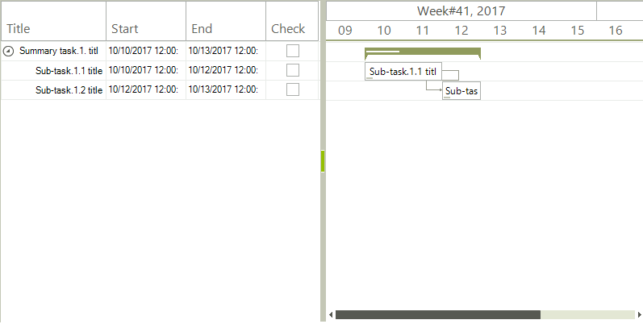

# Custom Data Cells

**RadGanttView** allows you to replace the standard cells displayed in the text view with custom ones. The following example demonstrates how to add a custom cell element having a check box.

>caption Figure 1: Checkbox Cell 

#### Custom Cell Implementation

<snippet id='ganttview-ganttcheckboxform-customcellclass-cs' />
<snippet id='ganttview-ganttcheckboxform-customcellclass-vb' />

The events which need to be handled are:
 
 * **DataCellElementCreating**: The custom cell element will be initialized in the event handler.
 * **ItemEditing**: The actual cell editing will be performed by the custom cell element with the check box. The event needs to be canceled so that the default editor will not initialize.

#### Handling Events

<snippet id='ganttview-ganttcheckboxform-handleevents-cs' />
<snippet id='ganttview-ganttcheckboxform-handleevents-vb' />

The data can be added to the control in the **OnLoad** method of the form. It is important to also add "*Check*" column in which the custom cell will be displayed.   

#### Initial Setup

<snippet id='ganttview-ganttcheckboxform-initialsetup-cs' />
<snippet id='ganttview-ganttcheckboxform-initialsetup-vb' />

# See Also

* [Custom Data Items]()
* [Custom Task Elements]()
* [Customizing editor]()
* [Editing Graphical View]()
* [Editing Text View]()
