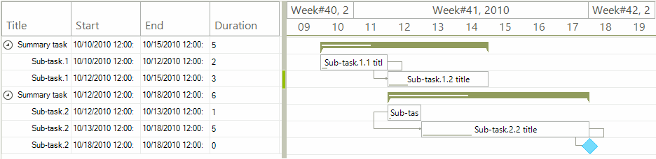

# Custom Data Items

The data items displayed in **RadGanttView** have a predefined set of properties allowing each of the items to have defined **Start**, **End**, and **Title** values. In certain cases, one may need to display an additional column in the Gantt control and map this column to a custom field defined in the data item class. This can be easily achieved by extending the **GanttViewDataItem** class with additional properties.

>note The new properties added to an inherited **GanttViewDataItem** class must have property setters.  

The example in this article will handle a scenario of a *Duration* column displaying how many days each of the tasks takes.

>caption Figure 1: Custom Data Item 

#### Setup the Control and Add Data

<snippet id='ganttview-ganttdataitemform-setupgantt-cs' />
<snippet id='ganttview-ganttdataitemform-setupgantt-vb' />

Our implementation of the custom **GanttViewDataItem** class will add an integer **Duration** property. This property will be calculated whenever the Start or the End of a task changes.  

#### Custom Data Item Implementation

<snippet id='ganttview-ganttdataitemform-customdataitem-cs' />
<snippet id='ganttview-ganttdataitemform-customdataitem-vb' />

The *Duration* column will be working with a **GanttViewSpinEditor** and considering our scenario, we will need to change the **MaxValue** property of the editor. This can be accomplished by handling the RadGanttView.GanttViewElement.**EditorInitialized** event.      

#### Handling the EditorInitialized event

<snippet id='ganttview-ganttdataitemform-editorinitializedevent-cs' />
<snippet id='ganttview-ganttdataitemform-editorinitializedevent-vb' />

# See Also

* [Custom Data Cells]()
* [Custom Task Elements]()
* [Customizing Editor]()
* [Editing Graphical View]()
* [Editing Text View]()
