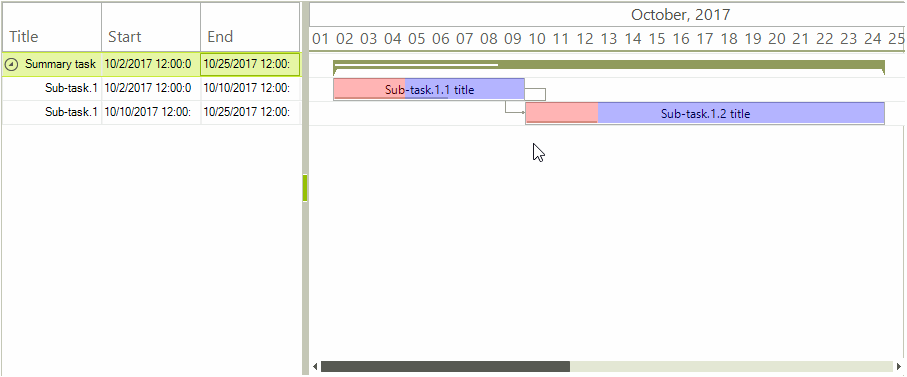

# Custom Task Elements

**RadGanttView** provides a convenient API to customize the task elements displayed in the graphical view. In this article we will create a custom **GanttViewTaskElement** which will host two additional children. Our special scenario requires that a certain part of the whole task be painted with one color and the remaining part with another. The actual size of the newly created elements will be calculated so that the first element always occupies a fixed number of days of the task while the second element will be arranged in the remaining space.

>caption Figure 1: Custom Task Elements

The methods which need to be overridden in the derived custom class are:
 
 * **CreateChildElements**: This method is responsible for initializing the child elements.
 * **ArrangeOverride**: This method is called whenever the layout of the **GanttViewTaskElement** needs to be updated. Our special logic for arranging the two newly added **LightVisualElements** will also be executed here.

#### Custom Task Element Implementation

<snippet id='ganttview-gantttaskelementform-customtaskelementclass-cs' />
<snippet id='ganttview-gantttaskelementform-customtaskelementclass-vb' />

The custom elements can be initialized in the handler of the RadGanttView.**ItemElementCreating** event. This event is part of API allowing the default elements to be substituted with custom ones.

#### Handling Events

<snippet id='ganttview-gantttaskelementform-handleevents-cs' />
<snippet id='ganttview-gantttaskelementform-handleevents-vb' />

# See Also

* [Creating Custom Cells]()
* [Customizing editor]()
* [Editing Graphical View]()
* [Editing Text View]()
* [Working Hours in GanttView]()
* [How to Build a Truck System with Custom Task Elements in GanttView]()
