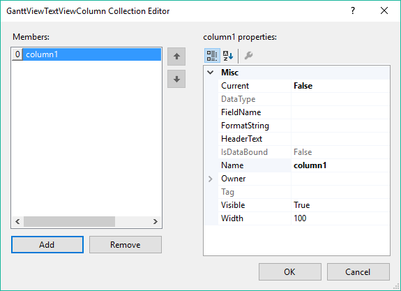

# Adding columns

The __GanttViewTextViewColumn__ CollectionEditor allows you to add columns to the gantt view at design time.

The more important properties of the column you need to set up are:

* __HeaderText:__ This is the text displayed in the header cell of the column.

* __Name:__ The name of the column. Must be unique for each column in the gantt view.

* __Visible:__ Determines whether this column is visible or not.

* __Width:__ Determines the width in pixels of the column.

* __FieldName:__ In __bound__ mode should be set to a property name of the data bound item of each __GanttViewDataItem__. The cells in this column will display the data from this property. In __unbound__ mode should be set to a property of __GanttViewDataItem__ or if you are using a custom data item to a property of this data item.

# See Also

* [Adding items]()
* [Adding links]()
* [Smart Tag]()
