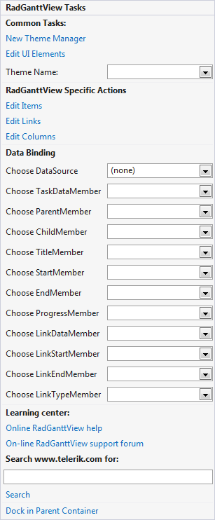

# Smart Tag

The Smart Tag for __RadGanttView__ lets you quickly access common tasks involved with customizing __RadGanttView__ elements, data binding and customizing its appearance through themes.
        

* __New Theme Manager:__ Adds a new RadThemeManager component to the form.
            

* __Theme Name:__ Select a theme name from the drop down list of themes available for that control. Selecting a theme allows you to change all aspects of the controls visual style at one time.
            

* __Edit Items:__ Opens a dialog that displays GanttViewDataItem Collection Editor. This editor lets you add task items to the gantt view.
            

* __Edit Links:__ Opens a dialog that displays GanttViewLinkDataItem Collection Editor. This editor lets you add links (dependences) between the items in the gantt view.
            

* __Edit Columns:__ Opens a dialog that displays GanttViewTextViewColumn Collection Editor. This editor lets you add columns to the gantt view.
            

* __Data Binding:__ In this section you can setup the data binding of the control. The different members are covered in details in the [data binding basics article.]()

* __Learning Center:__ Navigate to the Telerik help, code library projects or support forum.
            

* __Search:__ Search the Telerik site for a given string.
            

* __Dock in parent container:__ Docks RadGanttView into its parent container.

# See Also

* [Adding items]()
* [Adding links]()
* [Adding columns]()
