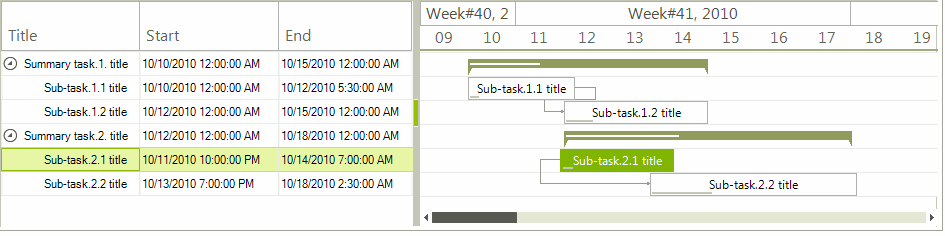

# GanttViewDragDropService 

**RadGanttView** supports drag and drop functionality for its tasks. It can be achieved by the **GanttViewDragDropService** which is accessed by the GanttViewElement.**DragDropService** property.

>caption Figure 1: Tasks drag and drop

The GanttViewDragDropService.**Location** property gives you the location from where the drag operation is started. The **Owner** property returns the **RadGanttViewElement**. If you need to disable dragging tasks, you can set the RadGanttView.**ReadOnly** property to *true*.

As a descendant of [RadDragDropService](), **GanttViewDragDropService** handles the whole drag and drop operation. The **PreviewDragOver** event allows you to control on what targets the task being dragged can be dropped on. The **PreviewDragDrop** event allows you to get a handle on all the aspects of the drag and drop operation, the source (drag) **RadGanttView**, the destination (target) control, as well as the task being dragged. 

# See Also

* [RadDragDropService]()	
