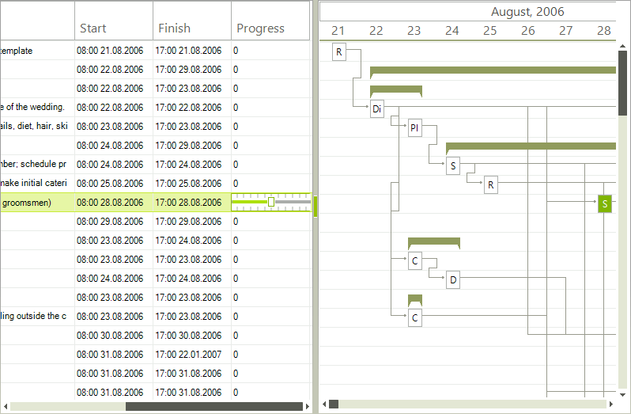

# Creating Custom Editor

__RadGanttView__ allows you to replace the standard editors with a custom ones. The following examples demonstrates how to replace the spin editor with a track bar editor. All editors inherit from __BaseInputEditor__. So, you have to inherit from this class and override several methods:

<snippet id='ganttview-customeditor-customtrackeditor-cs' />
<snippet id='ganttview-customeditor-customtrackeditor-vb' />

In the __EditorRequired__ event you can replace the default editor:

<snippet id='ganttview-customeditor-customeditorreplace-cs' />
<snippet id='ganttview-customeditor-customeditorreplace-vb' />

# See Also

* [Customizing editor]()
* [Editing Graphical View]()
* [Editing Text View]()
