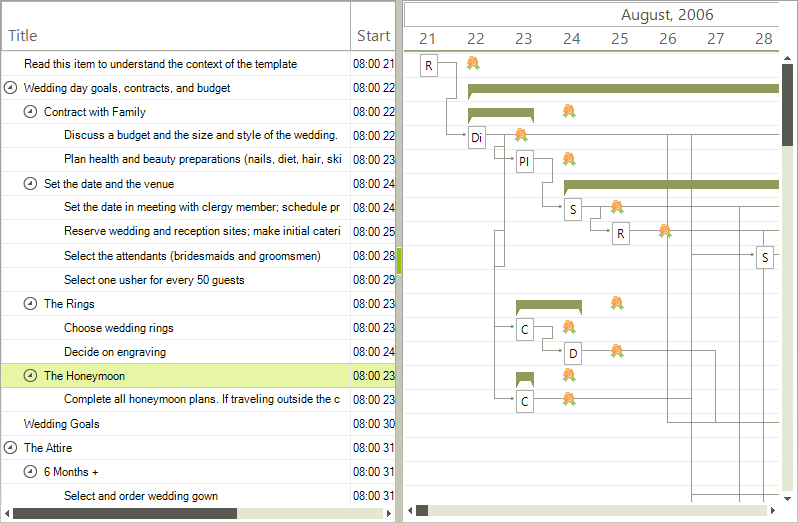
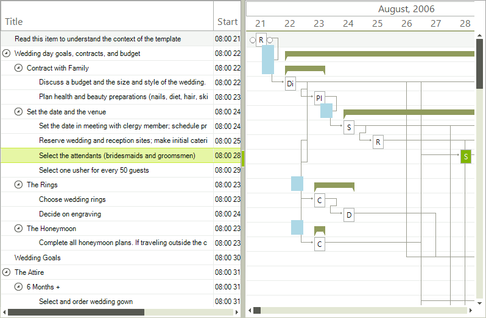

# Custom Painting

__RadGanttView__ offers several method of customizing the looks of the elements it is displaying. One of these methods is allowing developers to directly draw over the control through its `Graphics` object. To enable this functionality you have to set the  __EnableCustomPainting__ property of the control to __true__ and to subscribe to the __ItemPaint__ event.
        
Since all the elements in the graphical view of the control are arranged along the timeline and their size depends on the current zoom level you need a way to know where you should draw you graphics. For this purpose we have implemented two methods which by given date and time return where this time or time range should appear in coordinates.

The following example demonstrates how to draw an image which appears exactly 12 hours after each task which has a duration longer than 12 hours.
         
<snippet id='ganttview-custompainting-formattingeventsubscribe1-cs' />
<snippet id='ganttview-custompainting-formattingeventsubscribe1-vb' />

<snippet id='ganttview-custompainting-formattingpaintevent1-cs' />
<snippet id='ganttview-custompainting-formattingpaintevent1-vb' />

Another example demonstrating how to draw a colored rectangle which would be 10 hours in duration and will "start" 18 hours before each summary task.

<snippet id='ganttview-custompainting-formattingeventsubscribe2-cs' />
<snippet id='ganttview-custompainting-formattingeventsubscribe2-vb' />

<snippet id='ganttview-custompainting-formattingpaintevent2-cs' />
<snippet id='ganttview-custompainting-formattingpaintevent2-vb' />

# See Also

* [GraphicalView item formatting]()
* [GraphicalView Link Item formatting]()
* [TextView item formatting]()
* [Themes]()
* [Timeline item formatting]()
