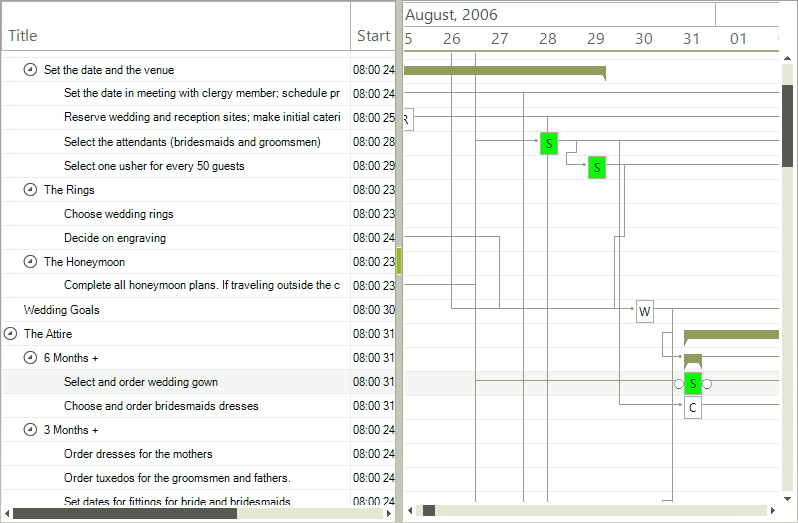

# GraphicalView Item Formatting

The __GraphicalViewItemFormatting__ event allows you to change the style and looks of the items displayed in the graphical view. The following example demonstrates how to format all tasks that involve some selection e.g. their title starts with "Select".
        
<snippet id='ganttview-graphicalviewitemformatting-graphicalviewitemformatting-cs' />
<snippet id='ganttview-graphicalviewitemformatting-graphicalviewitemformatting-vb' />

# See Also

* [Custom Painting]()
* [GraphicalView Link Item formatting]()
* [TextView item formatting]()
* [Themes]()
* [Timeline item formatting]()
