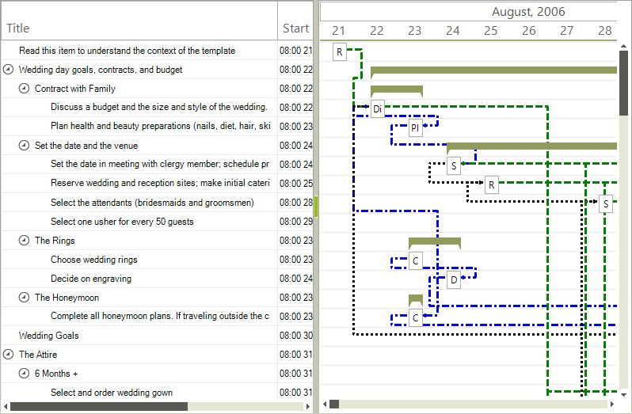

# GraphicalView Link Item Formatting

__RadGanttView__ allows formatting of individual links through the __GraphicalViewLinkItemFormatting__ event. The following example demonstrates how to format links based on their type.

<snippet id='ganttview-graphicalviewlinkitemformatting-graphicalviewlinkitemformatting-cs' />
<snippet id='ganttview-graphicalviewlinkitemformatting-graphicalviewlinkitemformatting-vb' />

# See Also

* [GraphicalView item formatting]()
* [Custom Painting]()
* [TextView item formatting]()
* [Themes]()
* [Timeline item formatting]()
