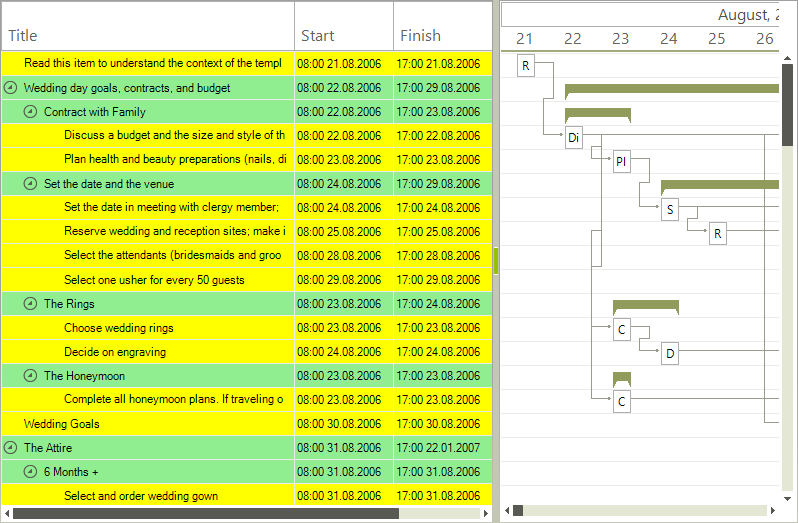
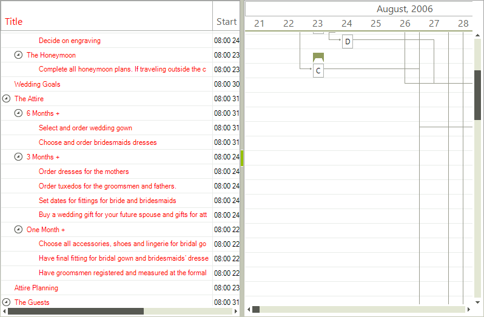

# TextView Item Formatting

__RadGanttView__ offers two events for formatting the text view part. The __TextViewItemFormatting__ event  is fired for each item (row) and the __TextViewCellFormatting__ is fired for every cell.

Here is an example demonstrating how to use the event to make all summary items have a green back color and all tasks a yellow one.
 
<snippet id='ganttview-textviewitemcellformatting-textviewitemformatting-cs' />
<snippet id='ganttview-textviewitemcellformatting-textviewitemformatting-vb' />

Another example showing how to change the fore color of the cells in the `Title` column for all types of tasks that start on an even day of the month.
        
<snippet id='ganttview-textviewitemcellformatting-textviewcellformatting-cs' />
<snippet id='ganttview-textviewitemcellformatting-textviewcellformatting-vb' />

# See Also

* [GraphicalView item formatting]()
* [GraphicalView Link Item formatting]()
* [Custom Painting]()
* [Themes]()
* [Timeline item formatting]()
