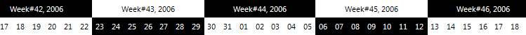

# Timeline Item Formatting

The __TimelineItemFormatting__ event allows you to format the style and look of the items in the timeline container. The following example demonstrates how to make the timeline appear as a checkered flag.
         
<snippet id='ganttview-timelineitemformatting-timelineitemformatting-cs' />
<snippet id='ganttview-timelineitemformatting-timelineitemformatting-vb' />

# See Also

* [GraphicalView item formatting]()
* [GraphicalView Link Item formatting]()
* [TextView item formatting]()
* [Themes]()
* [Custom Painting]()
